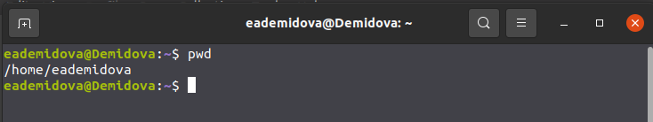
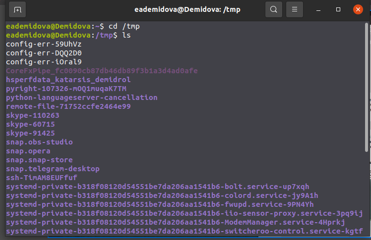
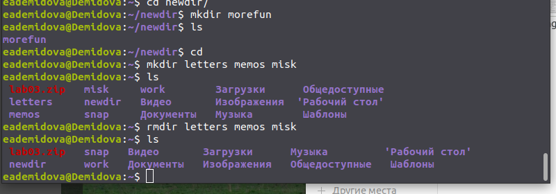
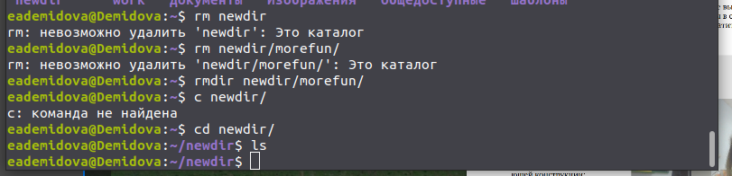
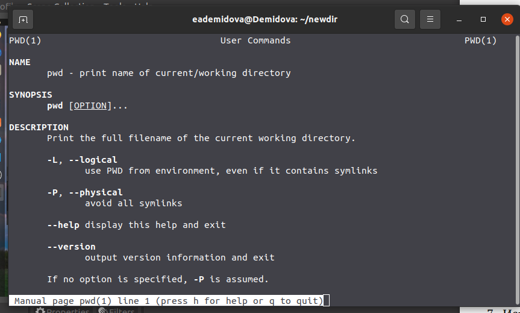
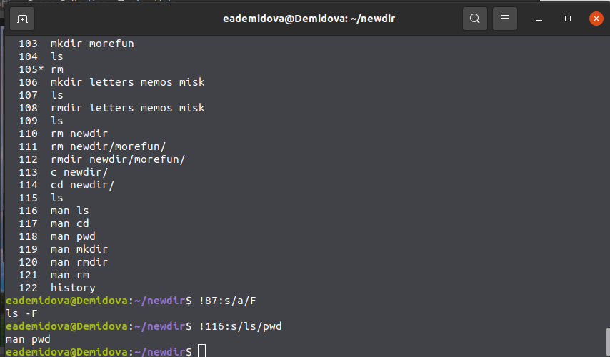

---
## Front matter
lang: ru-RU
title: Лабораторная работа №4
author: |
	Демидова Е.А.
institute: Российский Университет дружбы народов
date: Операционные системы -- 2022

## Formatting
toc: false
slide_level: 2
theme: metropolis
header-includes: 
 - \metroset{progressbar=frametitle,sectionpage=progressbar,numbering=fraction}
 - '\makeatletter'
 - '\beamer@ignorenonframefalse'
 - '\makeatother'
aspectratio: 43
section-titles: true
---

# Введение

## Введение

**Цель работы**

Приобретение практических навыков взаимодействия пользователя с систе-
мой посредством командной строки.

**Задачи**

- Изучить теоретичсеким материал по работе с командной строкой

- Изучить команды ls, cd, rm, rmdir, mkdir, pwd и научиться их применять

- Узнать информацию о командах с помощью комнанды man

# Результаты работы

## Использование некоторых команд

Определили полное имя домашнего каталога
{ #fig:001 width=80% }

Использовали команду ls и cd
{ #fig:002 width=80% }

## Использование некоторых команд

Создадали каталоги с помощью mkdir
{ #fig:010 width=80% }

Удалили каталог
{ #fig:011 width=80% }

## Использование некоторых команд

Использовали команду man
{ #fig:016 width=80% }

## Использование некоторых команд

Использовали команду history и выполнили модификацию и исполнение нескольких команд из буфера команд
{ #fig:020 width=80% }

## Выводы

В результате лабораторной работы я приобрела практические навыки взаимодействия пользователя с системой посредством командной строки.

## Список литературы

1. Робачевский А., Немнюгин С., Стесик О. Операционная система UNIX. 2-е
изд. БХВ-Петербург, 2010. 656 с.

## {.standout}

Спасибо за внимание
