---
## Front matter
title: "Лабораторная работа №4"
subtitle: "Основы интерфейса взаимодействия
пользователя с системой Unix на уровне командной строки"
author: "Демидова Екатерина Алексеевна"

## Generic otions
lang: ru-RU
toc-title: "Содержание"

## Bibliography
bibliography: bib/cite.bib
csl: pandoc/csl/gost-r-7-0-5-2008-numeric.csl

## Pdf output format
toc: true # Table of contents
toc-depth: 2
lof: true # List of figures
lot: false # List of tables
fontsize: 12pt
linestretch: 1.5
papersize: a4
documentclass: scrreprt
## I18n polyglossia
polyglossia-lang:
  name: russian
  options:
	- spelling=modern
	- babelshorthands=true
polyglossia-otherlangs:
  name: english
## I18n babel
babel-lang: russian
babel-otherlangs: english
## Fonts
mainfont: PT Serif
romanfont: PT Serif
sansfont: PT Sans
monofont: PT Mono
mainfontoptions: Ligatures=TeX
romanfontoptions: Ligatures=TeX
sansfontoptions: Ligatures=TeX,Scale=MatchLowercase
monofontoptions: Scale=MatchLowercase,Scale=0.9
## Biblatex
biblatex: true
biblio-style: "gost-numeric"
biblatexoptions:
  - parentracker=true
  - backend=biber
  - hyperref=auto
  - language=auto
  - autolang=other*
  - citestyle=gost-numeric
## Pandoc-crossref LaTeX customization
figureTitle: "Рис."
tableTitle: "Таблица"
listingTitle: "Листинг"
lofTitle: "Список иллюстраций"
lotTitle: "Список таблиц"
lolTitle: "Листинги"
## Misc options
indent: true
header-includes:
  - \usepackage{indentfirst}
  - \usepackage{float} # keep figures where there are in the text
  - \floatplacement{figure}{H} # keep figures where there are in the text
---

# Цель работы

Приобретение практических навыков взаимодействия пользователя с системой по-
средством командной строки.

# Задание

Здесь приводится описание задания в соответствии с рекомендациями
методического пособия и выданным вариантом.

# Теоретическое введение

 Алфавитно-цифровой терминал — последовательное устройство, и операци­онная система 
производит обмен данными с терминалом через последова­тельный интерфейс, называемый терминальной линией. 
С каждой терми­нальной линией в ОС UNIX ассоциирован специальный файл символьного
устройства /dev-ttyxx.
 Терминальные драйверы выполняют ту же функцию, что и остальные драй­
веры: управление передачей данных от/на терминалы. Однако терминалы
имеют одну особенность, связанную с тем, что они обеспечивают интерфейс
пользователя с системой. Обеспечивая интерактивное использование систе­
мы UNIX, терминальные драйверы имеют свой внутренний интерфейс
с модулями, интерпретирующими ввод и вывод строк. Модуль, отвечающий
за такую обработку, называется дисциплиной линии[@robachevsky:unix].

# Выполнение лабораторной работы

Определим плное имя домашнего каталога c помощью команды pwd (рис. [-@fig:001])

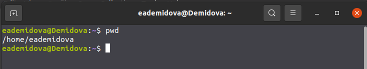{ #fig:001 width=70% }

Перейдём в каталог tmp с помощью команды cd и просмотрим сначала содержимое каталога с помощью ls без дополнительных параметров (рис. [-@fig:002])

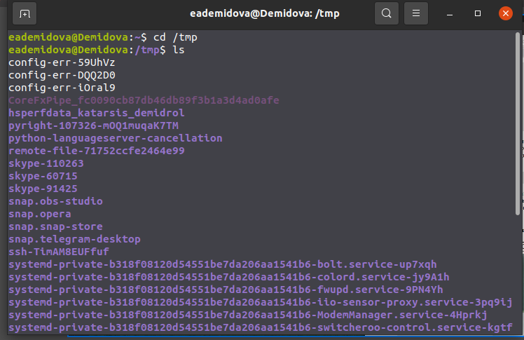{ #fig:002 width=70% }

Затем посмотрим содержимое с помощью команды ls -a, которая показывает ещё и имена скрытых файлов (рис. [-@fig:003])

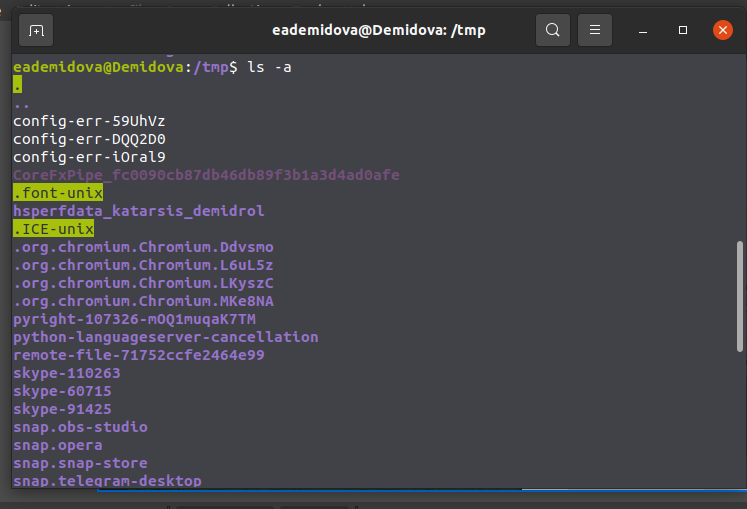{ #fig:003 width=70% }

Затем посмотрим содержимое с помощью команды ls -F, которая показывает информацию о типах файлов каталог, исполняемый файл, ссылка) (рис. [-@fig:004])

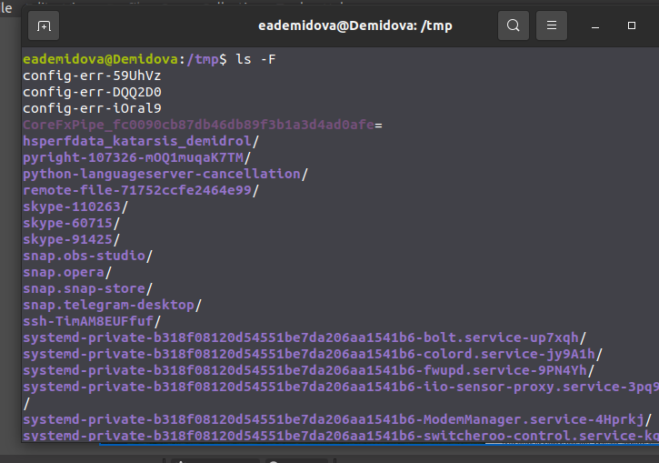{ #fig:004 width=70% }

Затем посмотрим содержимое с помощью команды ls -l, которая выводит на экран подробную информацию о файлах и каталогах (рис. [-@fig:005])

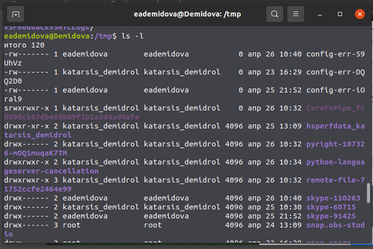{ #fig:005 width=70% }

Определим, есть ли в каталоге /var/spool подкаталог с именем cron, с помощью команд cd и ls. Помсле выполнения команд становится очевидно, что он там содержится
(рис. [-@fig:006])

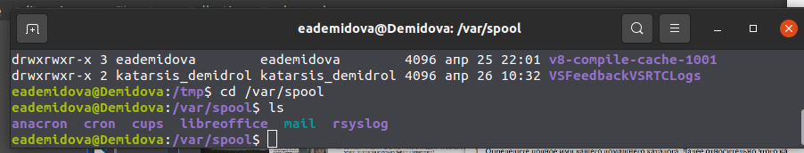{ #fig:006 width=70% }

Перейдем в домашний каталог и выведим на экран его содержимое.Определим с помощью команды ls -l, что владельцем файлов является eademidova (рис. [-@fig:007])

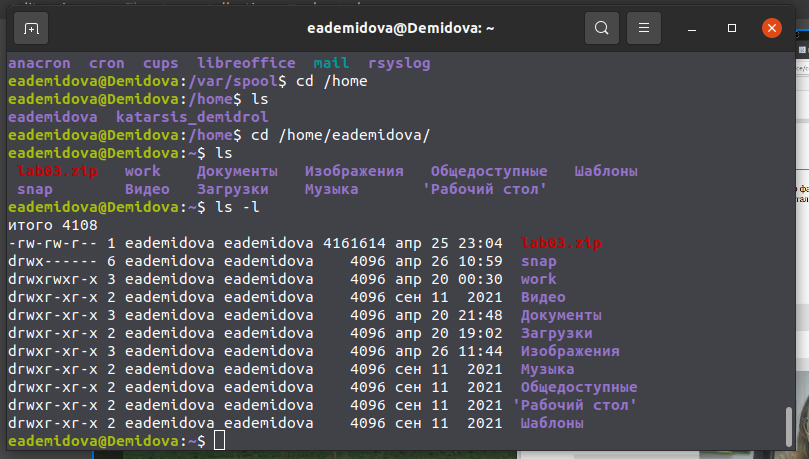{ #fig:007 width=70% }

Создадим в домашнем каталоге новый каталог с именем newdir с помощью команды mkdir (рис. [-@fig:008])

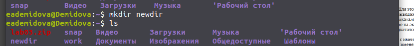{ #fig:008 width=70% }

Затем создадим в newdir подкаталог morefun (рис. [-@fig:009])

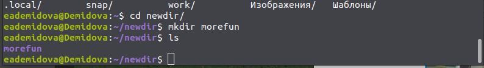{ #fig:009 width=70% }

В домашнем каталоге создадим одной командой три новых каталога с именами
letters, memos, misk. Затем удалим эти каталоги одной командой rmdir. (рис. [-@fig:010])

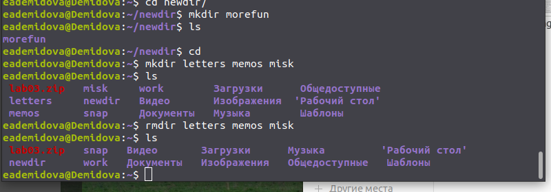{ #fig:010 width=70% }

Попробуем удалить ранее созданный каталог ~/newdir командой rm. Заметим, что удаление не удалось. А при удалении каталога  ~/newdir/morefun из домашнего каталога с помощью команды rmdir каталог действительно удаляется (рис. [-@fig:011])

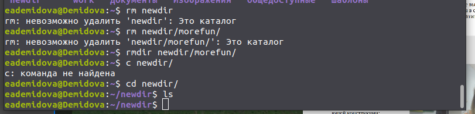{ #fig:011 width=70% }

С помощью команды man определим, что опцию -r команды ls нужно использо-
вать для просмотра содержимое не только указанного каталога, но и подкаталогов,
входящих в него (рис. [-@fig:012])

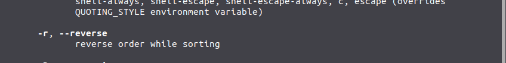{ #fig:012 width=70% }

С помощью команды man определиим набор опций -t -l команды ls, позволяющий отсорти-
ровать по времени последнего изменения выводимый список содержимого каталога
с развёрнутым описанием файлов (рис. [-@fig:013,-@fig:014])

{ #fig:013 width=70% }

{ #fig:014 width=70% }

Используем команду man для просмотра описания команды cd. Получим, что cd меняетя рабочий каталог (рис. [-@fig:015])

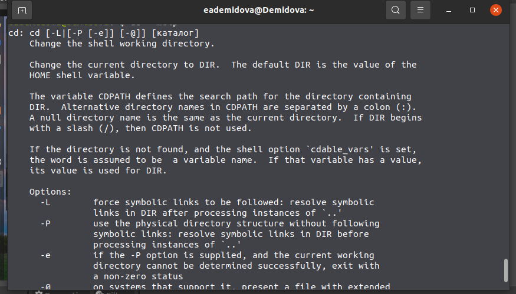{ #fig:015 width=70% }

Используем команду man для просмотра описания команды pwd. Получим, что pwd - выводит имя текущей/рабочей директории (рис. [-@fig:016])

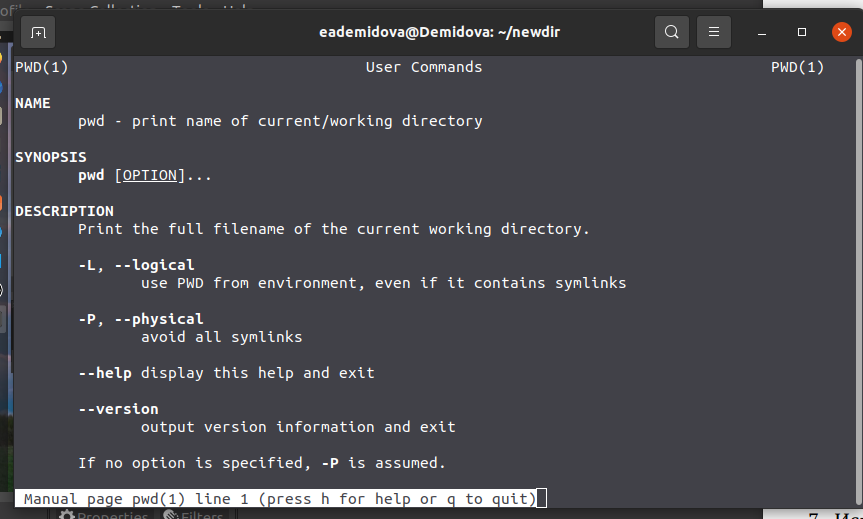{ #fig:016 width=70% }

Используtv команду man для просмотра описания команды mkdir. Получим, что mkdir - создает директории (рис. [-@fig:017])

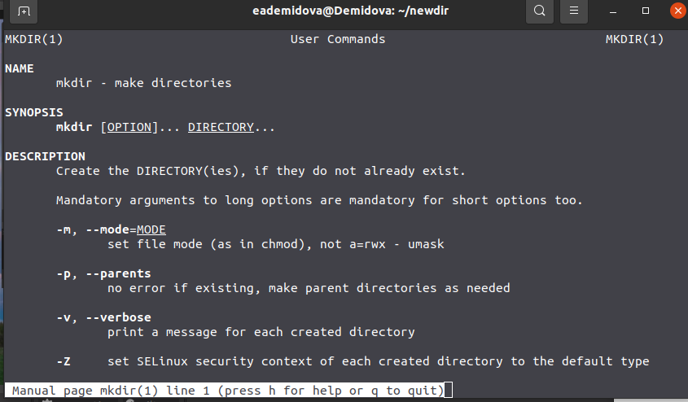{ #fig:017 width=70% }

Используtv команду man для просмотра описания команды rmdir. Получим, что rmdir - удаляет пустые директории (рис. [-@fig:018])

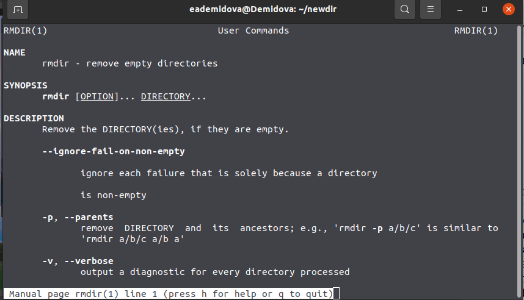{ #fig:018 width=70% }

Используtv команду man для просмотра описания команды rm. Получим, что rm - удаляет файлы или директории (рис. [-@fig:019])

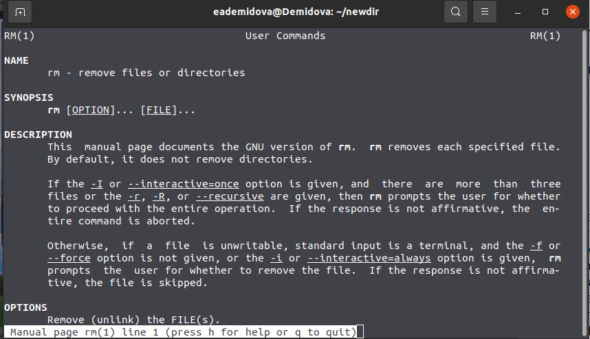{ #fig:019 width=70% }

Используя информацию, полученную при помощи команды history, выполним модификацию и исполнение нескольких команд из буфера команд (рис. [-@fig:020])

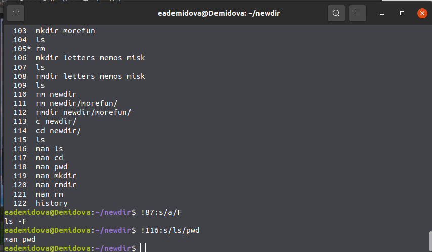{ #fig:020 width=70% }

# Выводы

В результате лабораторной работы я приобрела практические навыки взаимодействия пользователя с системой посредством командной строки.

# Контрольные вопросы

1. Компьютерный терминал - это интерфейс, позволяющий пользователю взаимодействовать с компьютером и его устройствами. Неоспоримым преимуществом является нетребовательность к железу, что позволяет раюотать даже на компьютерах с минимальной конфигурацией. Также исключаются баги и фризы GUI, что также ускоряет работу.
2. Имя, под которым пользователь логинится в системе
3. Пароли хранятся в скрытом файле /etc/shadow, который скрыт от обычных пользователей
4. В домашнем каталоге пользователя
5. root
6. Да, имеет
7. Иерархия пользователей, в зависимости от выданных прав. Для всех каталогов и файлов используются модификаторы доступа, которые позволяют регулировать действия других пользователей
8. UID, GID, GECOS, домашнюю директорию, версию shell

9. UID - уникальный идентификатор пользователя, GID - групповой идентификатор пользователя
10. GECOS - номер поля учетной записи в файле /etc/passwd
11. Домашний каталог - это каталог пользователя, в котором хранятся все его файлы и данные
12. /home/vakarvetskiy
13. Да, администратор может изменять содержимое домашнего каталога пользователя
14. В этом файле хранятся данные об учетных записях пользователей
15. Если в поле пароля стоит символ *, то пользователь не сможет войти в систему
16. Виртуальные консоли - это представление многотерминальной раюоты в рамках одного устройства. В данном контексте вируальные - значит, что они все равно работают с этим устройством 17. Для управления консолями, как физическими, так и виртуальными
18. Это процесс обмена информацией пользователя и компьютера после авторизации пользователя и до завершения сеанса пользователем
19. Готовый набор программ для определенных целей 20. GTK, GTK+, GDK, Qt

# Список литературы{.unnumbered}

::: {#refs}
:::
