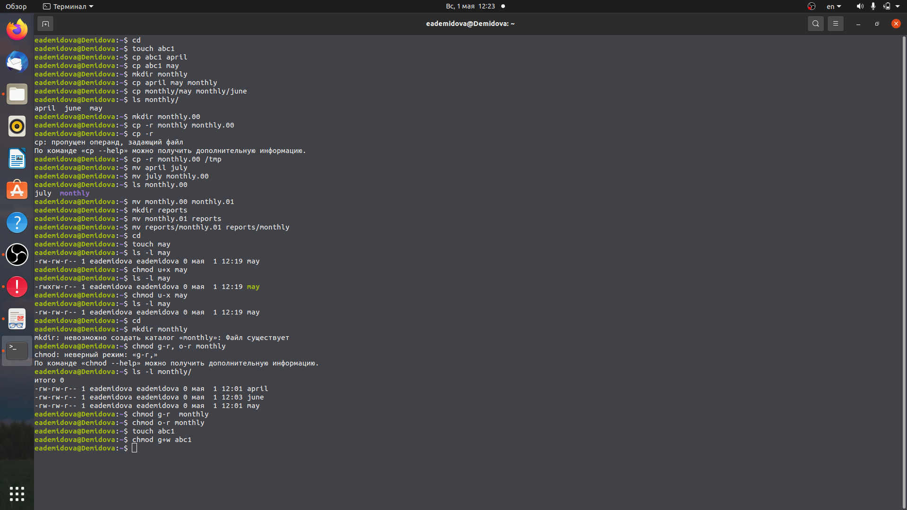
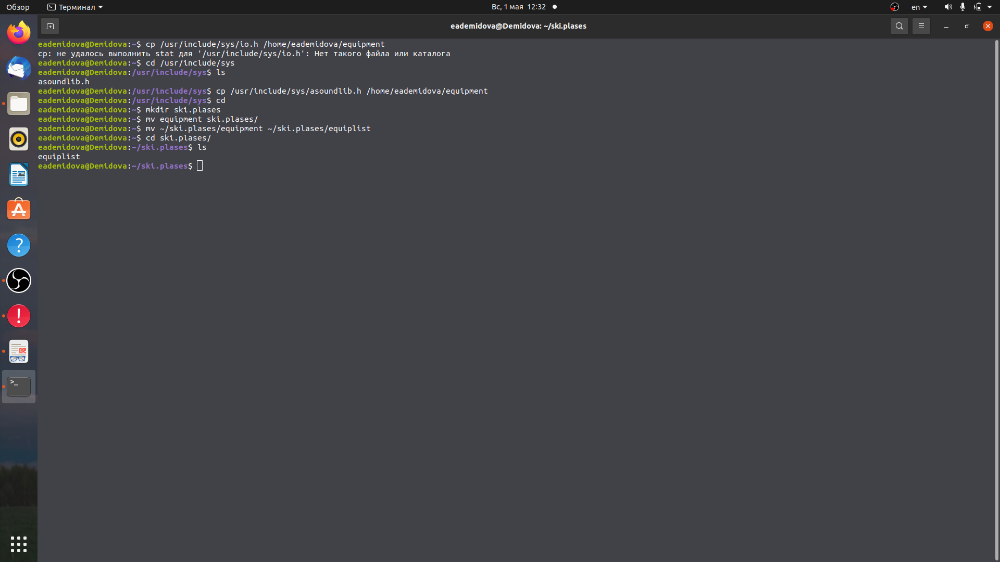
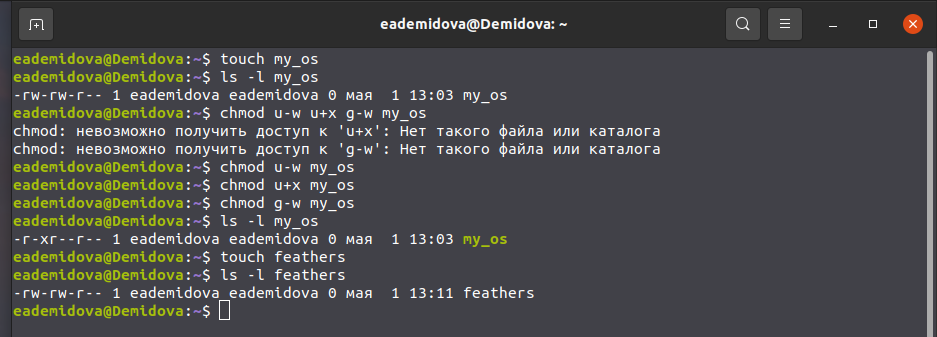
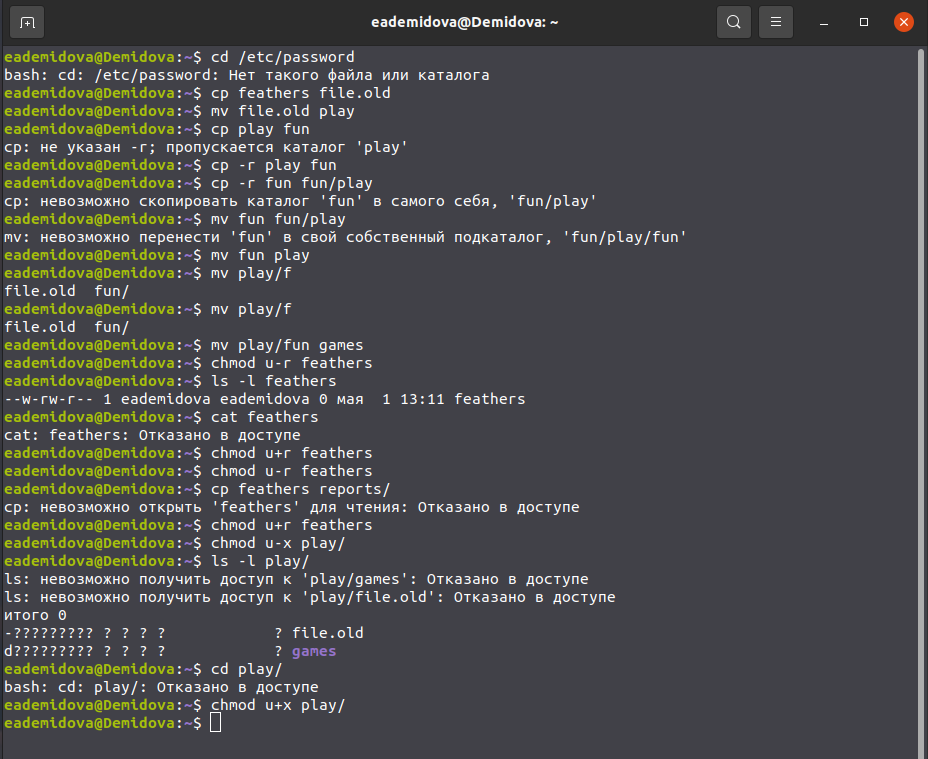

---
## Front matter
lang: ru-RU
title: Лабораторная работа №5
author: |
	Демидова Е.А.
institute: Российский Университет дружбы народов
date: Операционные системы -- 2022

## Formatting
toc: false
slide_level: 2
theme: metropolis
header-includes: 
 - \metroset{progressbar=frametitle,sectionpage=progressbar,numbering=fraction}
 - '\makeatletter'
 - '\beamer@ignorenonframefalse'
 - '\makeatother'
aspectratio: 43
section-titles: true
---

# Введение

## Введение

**Цель работы**

Ознакомление с файловой системой Linux, её структурой, именами и содержанием
каталогов. Приобретение практических навыков по применению команд для работы
с файлами и каталогами, по управлению процессами (и работами), по проверке исполь-
зования диска и обслуживанию файловой системы.

**Задачи**

- Выполнить примеры, приведённые в первой части описания лабораторной работы.

- Изучить команды cp, mkdir, mv, chmod и научиться их применять

- Узнать информацию о командах с помощью комнанды man

# Результаты работы

## Примеры

Выполним все примеры, приведённые в первой части описания лабораторной работы
{ #fig:001 width=70% }

## Использование некоторых команд

Скопируем файл /usr/include/sys/ascoundlib.h в домашний каталог с помощью команды cp и назовем его equipment, переименовав с помощью команды mv. В домашнем каталоге создадим директорию ~/ski.plases с помощью команды mkdir. Переместите файл equipment в каталог ~/ski.plases, bcgjkmpez rjvfyle mv. Переименуtv файл ~/ski.plases/equipment в ~/ski.plases/equiplist командой mv
{ #fig:002 width=70% 

## Права доступа

Создадим файл my_os и применим опции u-w, u+x, g-w. Затем создадим файk feathers, при просмотре прав заметим, что ничего менять не надо
{ #fig:007 width=70% }

## Использование некоторых команд

Выполнение пункта 4
{ #fig:008 width=70% }

## Выводы

В результате лабораторной работы я ознакомилась с файловой системой Linux, её структурой, именами и содержанием
каталогов. Приобрела практические навыки по применению команд для работы
с файлами и каталогами, по управлению процессами (и работами), по проверке использования диска и обслуживанию файловой системы.

## Список литературы

1. Робачевский А., Немнюгин С., Стесик О. Операционная система UNIX. 2-е
изд. БХВ-Петербург, 2010. 656 с.

## {.standout}

Спасибо за внимание
