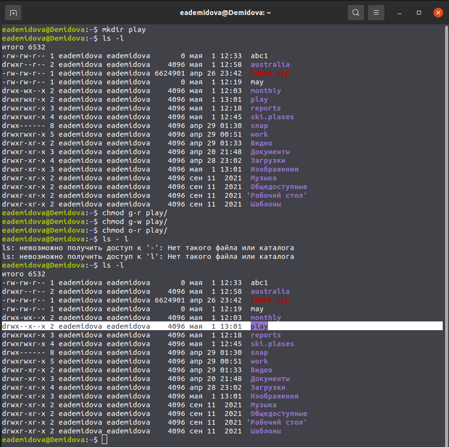

---
## Front matter
title: "Лабораторная работа №5"
subtitle: "Анализ файловой системы Linux.
Команды для работы с файлами и каталогами"
author: "Демидова Екатерина Алексеевна"

## Generic otions
lang: ru-RU
toc-title: "Содержание"
## Bibliography
bibliography: bib/cite.bib
csl: pandoc/csl/gost-r-7-0-5-2008-numeric.csl

## Pdf output format
toc: true # Table of contents
toc-depth: 2
lof: true # List of figures
lot: false # List of tables
fontsize: 12pt
linestretch: 1.5
papersize: a4
documentclass: scrreprt
## I18n polyglossia
polyglossia-lang:
  name: russian
  options:
	- spelling=modern
	- babelshorthands=true
polyglossia-otherlangs:
  name: english
## I18n babel
babel-lang: russian
babel-otherlangs: english
## Fonts
mainfont: PT Serif
romanfont: PT Serif
sansfont: PT Sans
monofont: PT Mono
mainfontoptions: Ligatures=TeX
romanfontoptions: Ligatures=TeX
sansfontoptions: Ligatures=TeX,Scale=MatchLowercase
monofontoptions: Scale=MatchLowercase,Scale=0.9
## Biblatex
biblatex: true
biblio-style: "gost-numeric"
biblatexoptions:
  - parentracker=true
  - backend=biber
  - hyperref=auto
  - language=auto
  - autolang=other*
  - citestyle=gost-numeric
## Pandoc-crossref LaTeX customization
figureTitle: "Рис."
tableTitle: "Таблица"
listingTitle: "Листинг"
lofTitle: "Список иллюстраций"
lotTitle: "Список таблиц"
lolTitle: "Листинги"
## Misc options
indent: true
header-includes:
  - \usepackage{indentfirst}
  - \usepackage{float} # keep figures where there are in the text
  - \floatplacement{figure}{H} # keep figures where there are in the text
---

# Цель работы

Ознакомление с файловой системой Linux, её структурой, именами и содержанием
каталогов. Приобретение практических навыков по применению команд для работы
с файлами и каталогами, по управлению процессами (и работами), по проверке исполь-
зования диска и обслуживанию файловой системы.

# Задание

1. Выполните все примеры, приведённые в первой части описания лабораторной работы.
2. Выполните следующие действия, зафиксировав в отчёте по лабораторной работе
используемые при этом команды и результаты их выполнения:
2.1. Скопируйте файл /usr/include/sys/io.h в домашний каталог и назовите его
equipment . Если файла io.h нет, то используйте любой другой файл в каталоге
/usr/include/sys/ вместо него.
2.2. В домашнем каталоге создайте директорию ~/ski.plases .
2.3. Переместите файл equipment в каталог ~/ski.plases .
2.4. Переименуйте файл ~/ski.plases/equipment в ~/ski.plases/equiplist .
2.5. Создайте в домашнем каталоге файл abc1 и скопируйте его в каталог
~/ski.plases , назовите его equiplist2 .
2.6. Создайте каталог с именем equipment в каталоге ~/ski.plases .
2.7. Переместите файлы ~/ski.plases/equiplist и equiplist2 в каталог
~/ski.plases/equipment
2.8. Создайте и переместите каталог ~/newdir в каталог ~/ski.plases и назовите
его plans .
3. Определите опции команды chmod , необходимые для того, чтобы присвоить перечис-
ленным ниже файлам выделенные права доступа, считая, что в начале таких прав
нет:
3.1. drwxr--r--
...
australia
3.2. drwx--x--x
...
play
3.3. -r-xr--r--
...
my_os
3.4. -rw-rw-r--
...
feathers
При необходимости создайте нужные файлы.
4. Проделайте приведённые ниже упражнения, записывая в отчёт по лабораторной
работе используемые при этом команды:
4.1. Просмотрите содержимое файла /etc/password .
4.2. Скопируйте файл ~/feathers в файл ~/file.old .
4.3. Переместите файл ~/file.old в каталог ~/play .
4.4. Скопируйте каталог ~/play в каталог ~/fun .
4.5. Переместите каталог ~/fun в каталог ~/play и назовите его games .
4.6. Лишите владельца файла ~/feathers права на чтение.
4.7. Что произойдёт, если вы попытаетесь просмотреть файл ~/feathers командой
cat ?
4.8. Что произойдёт, если вы попытаетесь скопировать файл ~/feathers ?
4.9. Дайте владельцу файла ~/feathers право на чтение.
4.10. Лишите владельца каталога ~/play права на выполнение.
4.11. Перейдите в каталог ~/play . Что произошло?
4.12. Дайте владельцу каталога ~/play право на выполнение.
5. Прочитайте man по командам mount , fsck , mkfs , kill и кратко их охарактеризуйте,
приведя примеры.

# Теоретическое введение

Большая часть данных в операционной системе UNIX хранится в файлах,
организованных в виде дерева и расположенных на некотором физическом
носителе информации. Обычно это локальный (то есть расположенный на
том же компьютере, что и сама операционная система) жесткий диск, хотя
распределенные файловые системы — NFS (Network File System), AFS (Andrew
File System) и некоторые другие обеспечивают хранение файлов на удален­
ном компьютере. Файловая система также может располагаться на CD или
DVD-ROM, дискетах и других типах носителей, однако для простоты изло­
жения мы сначала рассмотрим традиционную файловую систему ОС UNIX,
расположенную на обычном жестком диске компьютера[@robachevsky:unix]..
Каждый жесткий диск состоит из одной или нескольких логических частей,
называемых разделами. Расположение и размер раздела определяются при
форматировании диска. В ОС UNIX разделы выступают в качестве незави­
симых устройств, доступ к которым осуществляется как к различным носи­
телям данных.
Например, диск может состоять из четырех разделов, каждый из которых
содержит свою файловую систему. Заметим, что в разделе может распола­
гаться только одна файловая система, которая не может занимать несколько
разделов. В другой конфигурации диск может состоять только из одного
раздела, позволяя создавать весьма емкие файловые системы.[@robachevsky:unix].

# Выполнение лабораторной работы

Выполним все примеры, приведённые в первой части описания лабораторной работы (рис. [-@fig:001])

{ #fig:001 width=70% }

Скопируем файл /usr/include/sys/ascoundlib.h в домашний каталог с помощью команды cp и назовем его equipment, переименовав с помощью команды mv. В домашнем каталоге создадим директорию ~/ski.plases с помощью команды mkdir. Переместите файл equipment в каталог ~/ski.plases, bcgjkmpez rjvfyle mv. Переименуtv файл ~/ski.plases/equipment в ~/ski.plases/equiplist командой mv(рис. [-@fig:002])

{ #fig:002 width=70% }

Создадим в домашнем каталоге файл abc1 командой mkdir и скопируем его командой cp в каталог ~/ski.plases, назовите его equiplist2, используя команду mv. Создадим командой mkdir каталог с именем equipment в каталоге ~/ski.plases. Переместим файлы ~/ski.plases/equiplist и equiplist2 в каталог ~/ski.plases/equipment командой mv. (рис. [-@fig:003])

{ #fig:003 width=70% }

Переместим файлы ~/ski.plases/equiplist и equiplist2 в каталог ~/ski.plases/equipment командой . Создадим и переместим каталог ~/newdir в каталог ~/ski.plases(команды mkdir и mv) и назовем его plans(команда mv). (рис. [-@fig:004])

{ #fig:004 width=70% }

Определим опции команды chmod, необходимые для того, чтобы присвоить определённые права доступа файлам из пункта 3. Создадим директорию australia, а затем применем опции g-w, g-x, o-x. (рис. [-@fig:005])

{ #fig:005 width=70% }

Создадим директорию play и используем опции g-r, g-w, o-r. (рис. [-@fig:006])

{ #fig:006 width=70% }

Создадим файл my_os и применим опции u-w, u+x, g-w. Затем создадим файk feathers, при просмотре прав заметим, что ничего менять не надо (рис. [-@fig:007])

{ #fig:007 width=70% }

4. Просмотрим содержимое файла /etc/password командой ls. Скопируем файл ~/feathers в файл ~/file.old командой cp. Переместиим командой mv файл ~/file.old в каталог ~/play. Скопируем командой cp каталог ~/play в каталог ~/fun. Переместим командой mv каталог ~/fun в каталог ~/play и назовем его games командой mv. Лишим владельца файла ~/feathers права на чтение командой chmod с опцией u-r. Если попытаться просмотреть файл ~/feathers командой cat, получим ошибку, так как недостаточно прав доступа. Если попытаться скопировать файл ~/feathers также выдаст ошибку. Дадим владельцу файла ~/feathers право на чтение командой chmod с опцией u+r. Лишим владельца каталога ~/play права на выполнение командой chmod с опцией u-x. Перейдtv в каталог ~/play, выясним, что данное действие нельзя сделать без прав на выполнение. Дадим права на выполнению командой chmod с опцией u+x (рис. [-@fig:008])

{ #fig:008 width=70% }

Используем команду man для просмотра описания команды mount. Узнаем, что она используется для просмотра используемых в операционной системе файловых систем.  (рис. [-@fig:009])

{ #fig:009 width=70% }

Используем команду man для просмотра описания команды fsck. С помощью команды fsck можно проверить (а в ряде случаев восстановить) целостность файловой системы. (рис. [-@fig:010])

{ #fig:010 width=70% }

Используем команду man для просмотра описания команды mkfs. Получим, что она используется для создания файловой системы Linux на некотором устройстве (рис. [-@fig:011])

{ #fig:011 width=70% }

Используем команду man для просмотра описания команды kill. Получим, что она передаёт сигнал для немеленного прекращения процесса (рис. [-@fig:012])

{ #fig:012 width=70% }

# Выводы

В результате лабораторной работы я ознакомилась с файловой системой Linux, её структурой, именами и содержанием
каталогов. Приобрела практические навыки по применению команд для работы
с файлами и каталогами, по управлению процессами (и работами), по проверке использования диска и обслуживанию файловой системы.

# Контрольные вопросы
1. Дайте характеристику каждой файловой системе, существующей на жёстком диске
компьютера, на котором вы выполняли лабораторную работу.

ext4 -  журналируемая файловая система, используемая преимущественно в операционных системах с ядром Linux, созданная на базе ext3 в 2006 году.

Основные изменения в ext4 по сравнению с ext3:
- увеличен максимальный объём одного раздела диска до 1 эксбибайта (260 байт) при размере блока 4 кибибайт;
- увеличен размера одного файла до 16 тебибайт (244 байт);
- введён механизм протяжённой (extent) записи файлов, уменьшающий фрагментацию и повышающий производительность (новая информация добавляется в конец области диска, выделенной заранее по соседству с областью, занятой файлом);
- поднято ограничение на число вложенных каталогов с 32 000 подкаталогов до 65 535 (при этом в некоторых случаях требуется изменить константы ядра).

2. Приведите общую структуру файловой системы и дайте характеристику каждой ди-
ректории первого уровня этой структуры.

/ — root каталог. Содержит в себе всю иерархию системы;

/bin — здесь находятся двоичные исполняемые файлы. Основные общие команды, хранящиеся отдельно от других программ в системе (прим.: pwd, ls, cat, ps);

/boot — тут расположены файлы, используемые для загрузки системы (образ initrd, ядро vmlinuz);

/dev — в данной директории располагаются файлы устройств (драйверов). С помощью этих файлов можно взаимодействовать с устройствами. К примеру, если это жесткий диск, можно подключить его к файловой системе. В файл принтера же можно написать напрямую и отправить задание на печать;

/etc — в этой директории находятся файлы конфигураций программ. Эти файлы позволяют настраивать системы, сервисы, скрипты системных демонов;

/home — каталог, аналогичный каталогу Users в Windows. Содержит домашние каталоги учетных записей пользователей (кроме root). При создании нового пользователя здесь создается одноименный каталог с аналогичным именем и хранит личные файлы этого пользователя;

/lib — содержит системные библиотеки, с которыми работают программы и модули ядра;

/lost+found — содержит файлы, восстановленные после сбоя работы системы. Система проведет проверку после сбоя и найденные файлы можно будет посмотреть в данном каталоге;

/media — точка монтирования внешних носителей. Например, когда вы вставляете диск в дисковод, он будет автоматически смонтирован в директорию /media/cdrom;

/mnt — точка временного монтирования. Файловые системы подключаемых устройств обычно монтируются в этот каталог для временного использования;

/opt — тут расположены дополнительные (необязательные) приложения. Такие программы обычно не подчиняются принятой иерархии и хранят свои файлы в одном подкаталоге (бинарные, библиотеки, конфигурации);

/proc — содержит файлы, хранящие информацию о запущенных процессах и о состоянии ядра ОС;

/root — директория, которая содержит файлы и личные настройки суперпользователя;

/run — содержит файлы состояния приложений. Например, PID-файлы или UNIX-сокеты;

/sbin — аналогично /bin содержит бинарные файлы. Утилиты нужны для настройки и администрирования системы суперпользователем;

/srv — содержит файлы сервисов, предоставляемых сервером (прим. FTP или Apache HTTP);

/sys — содержит данные непосредственно о системе. Тут можно узнать информацию о ядре, драйверах и устройствах;

/tmp — содержит временные файлы. Данные файлы доступны всем пользователям на чтение и запись. Стоит отметить, что данный каталог очищается при перезагрузке;

/usr — содержит пользовательские приложения и утилиты второго уровня, используемые пользователями, а не системой. Содержимое доступно только для чтения (кроме root). Каталог имеет вторичную иерархию и похож на корневой;

+
/var — содержит переменные файлы. Имеет подкаталоги, отвечающие за отдельные переменные. Например, логи будут храниться в /var/log, кэш в /var/cache, очереди заданий в /var/spool/ и так далее.

3. Какая операция должна быть выполнена, чтобы содержимое некоторой файловой
системы было доступно операционной системе?

Монтирование тома

4. Назовите основные причины нарушения целостности файловой системы. Как устра-
нить повреждения файловой системы?

Отсутствие синхронизации между образом файловой системы в памяти и ее данными на диске в случае аварийного останова может привести к появлению следующих ошибок:

 1. Один блок адресуется несколькими mode (принадлежит нескольким файлам).

 2. Блок помечен как свободный, но в то же время занят (на него ссылается onode).

 3. Блок помечен как занятый, но в то же время свободен (ни один inode на него не ссылается).

 4. Неправильное число ссылок в inode (недостаток или избыток ссылающихся записей в каталогах).

 5. Несовпадение между размером файла и суммарным размером адресуемых inode блоков.\
 
 6. Недопустимые адресуемые блоки (например, расположенные за пределами файловой системы).

 7. "Потерянные" файлы (правильные inode, на которые не ссылаются записи каталогов).

 8. Недопустимые или неразмещенные номера inode в записях каталогов.

5. Как создаётся файловая система?

Монтирование тома.

6. Дайте характеристику командам для просмотра текстовых файлов.

Cat - выводит содержимое файла на стандартное устройство вывода

7. Приведите основные возможности команды cp в Linux.

Cp – копирует или перемещает директорию, файлы

8. Приведите основные возможности команды mv в Linux.

Mv - переименовать или переместить файл или директорию

9. Что такое права доступа? Как они могут быть изменены?
При ответах на вопросы используйте дополнительные источники информации по
теме.

Права доступа к файлу или каталогу можно изменить, воспользовавшись командой chmod. Сделать это может владелец файла (или каталога) или пользователь с правами администратора.

# Список литературы{.unnumbered}

::: {#refs}
:::
