---
## Front matter
lang: ru-RU
title: Лабораторная работа №6
author: |
	Демидова Е.А.
institute: Российский Университет дружбы народов
date: Операционные системы -- 2022

## Formatting
toc: false
slide_level: 2
theme: metropolis
header-includes: 
 - \metroset{progressbar=frametitle,sectionpage=progressbar,numbering=fraction}
 - '\makeatletter'
 - '\beamer@ignorenonframefalse'
 - '\makeatother'
aspectratio: 43
section-titles: true
---

# Введение

## Введение

**Цель работы**

Ознакомление с инструментами поиска файлов и фильтрации текстовых данных.
Приобретение практических навыков: по управлению процессами (и заданиями), по
проверке использования диска и обслуживанию файловых систем.

**Задачи**

- Использовать на практике перенаправление вывода и ввода.

- Научиться заупскать процессы в фоновом режиме и останавливать их с помощью команды kill.

- Изучить команды find и prep и научиться их применять

- Узнать информацию о командах df и du и использовать их.

# Результаты работы

## Перенаправление потока вывода

Запишем в файл file.txt названия файлов, содержащихся в каталоге /etc с помощью команды ls -lR /etc > dir-tree.list.
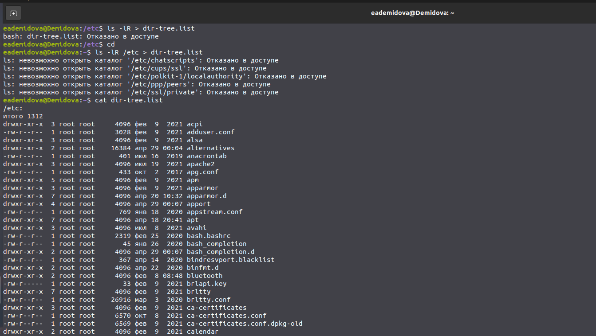{ #fig:001 width=70% }

Допишем в этот же файл названия файлов, содержащихся в домашнем каталоге с помощью команды ls -lR >> dir-tree.list.
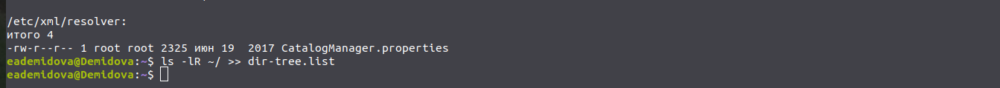{ #fig:002 width=70% }

## Перенаправление потока вывода

Выведим имена всех файлов из file.txt, имеющих расширение .conf, после чего
запишем их в новый текстовой файл conf.txt.
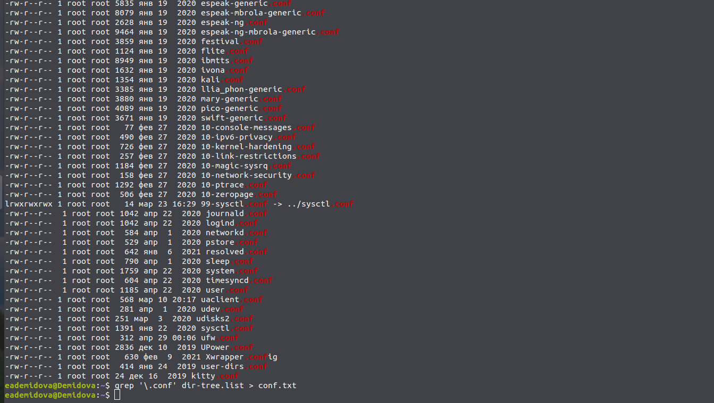{ #fig:003 width=70% }

## Использование команд find и grep

Определим, какие файлы в домашнем каталоге имеют имена, начинавшиеся
с символа c помощью команд find и grep
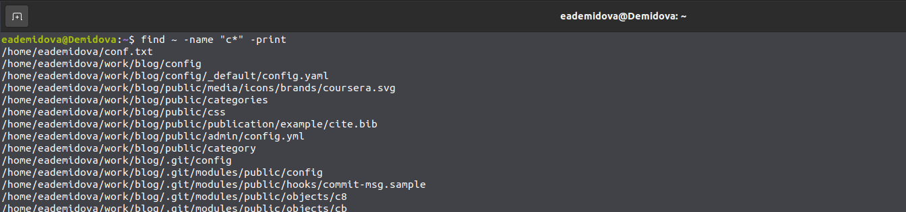{ #fig:004 width=75% }
{ #fig:005 width=75% }

## Использование команды find

Выведем на экран (по странично) имена файлов из каталога /etc, начинающиеся
с символа h с помощью команды find.
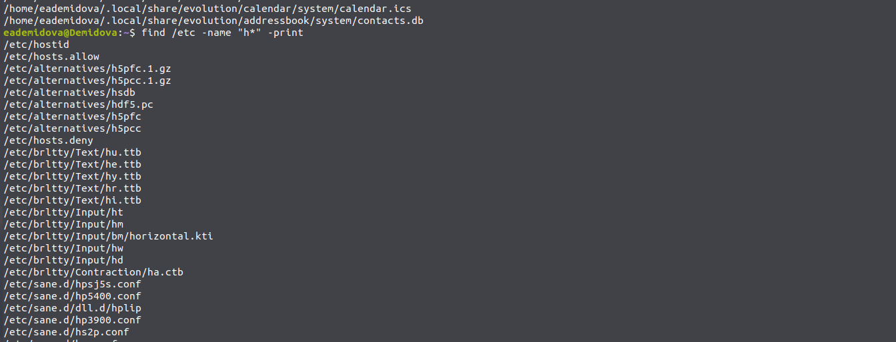{ #fig:006 width=80% }

## Запуск процесса в фоновом режиме

Запустим в фоновом режиме процесс, который будет записывать в файл ~/logfile
файлы, имена которых начинаются с log. Затем удалим файл ~/logfile.
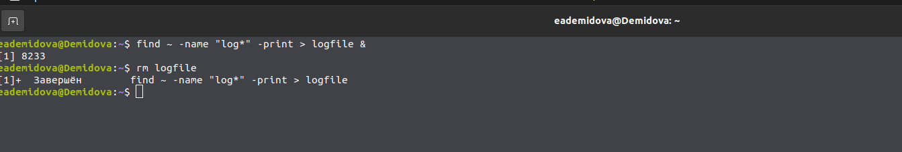{ #fig:007 width=70% }

Запустим из консоли в фоновом режиме редактор gedit.
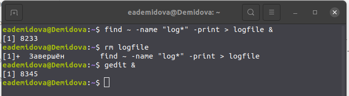{ #fig:008 width=70% }

## Прерывание процесса

Определим идентификатор процесса gedit, используя команду ps, конвейер и фильтр
grep.
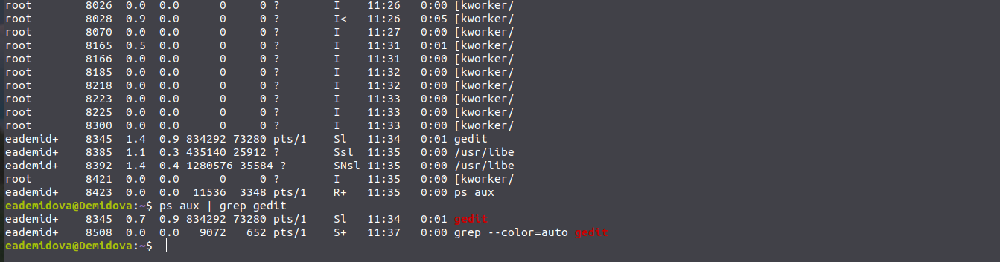{ #fig:009 width=70% }

Прочтем справку (man) команды kill, после чего используем её для завершения
процесса gedit.
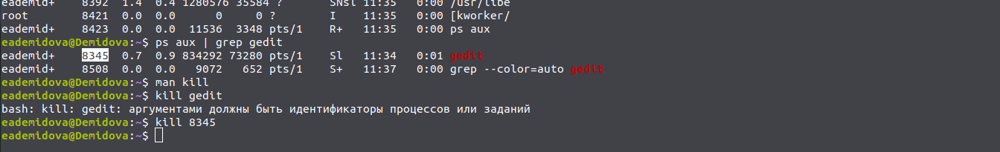{ #fig:010 width=70% }

## Команды df и du

Выполним команды df и du, предварительно получив более подробную информацию
об этих командах, с помощью команды man.
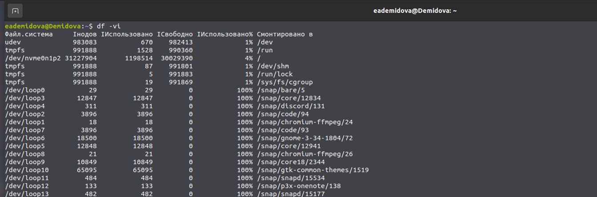{ #fig:011 width=70% }
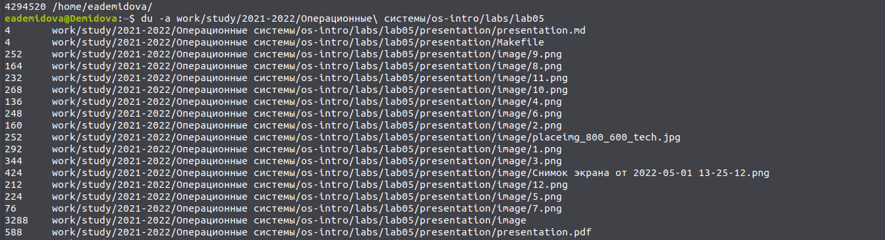{ #fig:012 width=70% }

## Использование команды find

Воспользовавшись справкой команды find , выведим имена всех директорий, имеющихся в моем домашнем каталоге
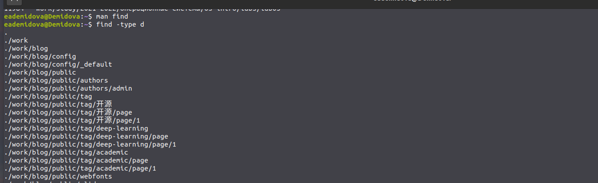{ #fig:013 width=80% }

## Выводы

В результате выполнения лабораторной работы ознакомилась с инструментами
поиска файлов и фильтрации текстовых данных. Приобретела практические
навыки: по управлению процессами (и заданиями), по проверке использования
диска и обслуживанию файловых систем.

## Список литературы

1.
Робачевский А., Немнюгин С., Стесик О. Операционная система UNIX. 2-е
изд. БХВ-Петербург, 2010. 656 с.
2.
Redirection [Электронный ресурс]. Wikimedia Foundation, Inc., 2021. URL:
https://ru.wikipedia.org/wiki/%D0%9F%D0%B5%D1%80%D0%B5%D
0%BD%D0%B0%D0%BF%D1%80%D0%B0%D0%B2%D0%BB%D0%B5%D
0%BD%D0%B8%D0%B5_%D0%B2%D0%B2%D0%BE%D0%B4%D0%B0-
%D0%B2%D1%8B%D0%B2%D0%BE%D0%B4%D0%B0..

## {.standout}

Спасибо за внимание
