---
## Front matter
title: "Лабораторная работа №6"
subtitle: "Поиск файлов. Перенаправление
ввода-вывода. Просмотр запущенных процессов"
author: "Демидова Екатерина Алексеевна"

## Generic otions
lang: ru-RU
toc-title: "Содержание"

## Bibliography
bibliography: bib/cite.bib
csl: pandoc/csl/gost-r-7-0-5-2008-numeric.csl

## Pdf output format
toc: true # Table of contents
toc-depth: 2
lof: true # List of figures
lot: false # List of tables
fontsize: 12pt
linestretch: 1.5
papersize: a4
documentclass: scrreprt
## I18n polyglossia
polyglossia-lang:
  name: russian
  options:
	- spelling=modern
	- babelshorthands=true
polyglossia-otherlangs:
  name: english
## I18n babel
babel-lang: russian
babel-otherlangs: english
## Fonts
mainfont: PT Serif
romanfont: PT Serif
sansfont: PT Sans
monofont: PT Mono
mainfontoptions: Ligatures=TeX
romanfontoptions: Ligatures=TeX
sansfontoptions: Ligatures=TeX,Scale=MatchLowercase
monofontoptions: Scale=MatchLowercase,Scale=0.9
## Biblatex
biblatex: true
biblio-style: "gost-numeric"
biblatexoptions:
  - parentracker=true
  - backend=biber
  - hyperref=auto
  - language=auto
  - autolang=other*
  - citestyle=gost-numeric
## Pandoc-crossref LaTeX customization
figureTitle: "Рис."
tableTitle: "Таблица"
listingTitle: "Листинг"
lofTitle: "Список иллюстраций"
lotTitle: "Список таблиц"
lolTitle: "Листинги"
## Misc options
indent: true
header-includes:
  - \usepackage{indentfirst}
  - \usepackage{float} # keep figures where there are in the text
  - \floatplacement{figure}{H} # keep figures where there are in the text
---

# Цель работы

Ознакомление с инструментами поиска файлов и фильтрации текстовых данных.
Приобретение практических навыков: по управлению процессами (и заданиями), по
проверке использования диска и обслуживанию файловых систем.

# Задание

1. Осуществите вход в систему, используя соответствующее имя пользователя.
2. Запишите в файл file.txt названия файлов, содержащихся в каталоге /etc . Допи-
шите в этот же файл названия файлов, содержащихся в вашем домашнем каталоге.
3. Выведите имена всех файлов из file.txt , имеющих расширение .conf , после чего
запишите их в новый текстовой файл conf.txt .
4. Определите, какие файлы в вашем домашнем каталоге имеют имена, начинавшиеся
с символа c ? Предложите несколько вариантов, как это сделать.
5. Выведите на экран (по странично) имена файлов из каталога /etc , начинающиеся
с символа h .
6. Запустите в фоновом режиме процесс, который будет записывать в файл ~/logfile
файлы, имена которых начинаются с log .
7. Удалите файл ~/logfile .
8. Запустите из консоли в фоновом режиме редактор gedit .
9. Определите идентификатор процесса gedit , используя команду ps , конвейер и фильтр
grep . Как ещё можно определить идентификатор процесса?
10. Прочтите справку ( man ) команды kill , после чего используйте её для завершения
процесса gedit .
11. Выполните команды df и du , предварительно получив более подробную информацию
об этих командах, с помощью команды man .
12. Воспользовавшись справкой команды find , выведите имена всех директорий, имею-
щихся в вашем домашнем каталоге

# Теоретическое введение

 Алфавитно-цифровой терминал — последовательное устройство, и операци­онная система 
производит обмен данными с терминалом через последова­тельный интерфейс, называемый терминальной линией. 
С каждой терми­нальной линией в ОС UNIX ассоциирован специальный файл символьного
устройства /dev-ttyxx.
 Терминальные драйверы выполняют ту же функцию, что и остальные драй­
веры: управление передачей данных от/на терминалы. Однако терминалы
имеют одну особенность, связанную с тем, что они обеспечивают интерфейс
пользователя с системой. Обеспечивая интерактивное использование систе­
мы UNIX, терминальные драйверы имеют свой внутренний интерфейс
с модулями, интерпретирующими ввод и вывод строк. Модуль, отвечающий
за такую обработку, называется дисциплиной линии[@robachevsky:unix].

Перенаправление ввода-вывода — возможность командной оболочки ряда операционных систем перенаправлять стандартные потоки в определённое пользователем место, например, в файл. Характерна для Unix-подобных операционных систем, но в разной степени реализована и в операционных системах других семейств. [@wiki:bash]

Конвейеры — это возможность нескольких программ работать совместно, когда выход одной программы непосредственно идет на вход другой без использования промежуточных временных файлов. Синтаксис: команда1 | команда2, выполняет команду1 используя её поток вывода как поток ввода при выполнении команды2, что равносильно использованию двух перенаправлений и временного файла[@wiki:bash]:
```
    команда1 > ВременныйФайл
    команда2 < ВременныйФайл
    rm ВременныйФайл
```

# Выполнение лабораторной работы

Запишем в файл file.txt названия файлов, содержащихся в каталоге /etc с помощью команды ls -lR /etc > dir-tree.list.(рис. [-@fig:001])

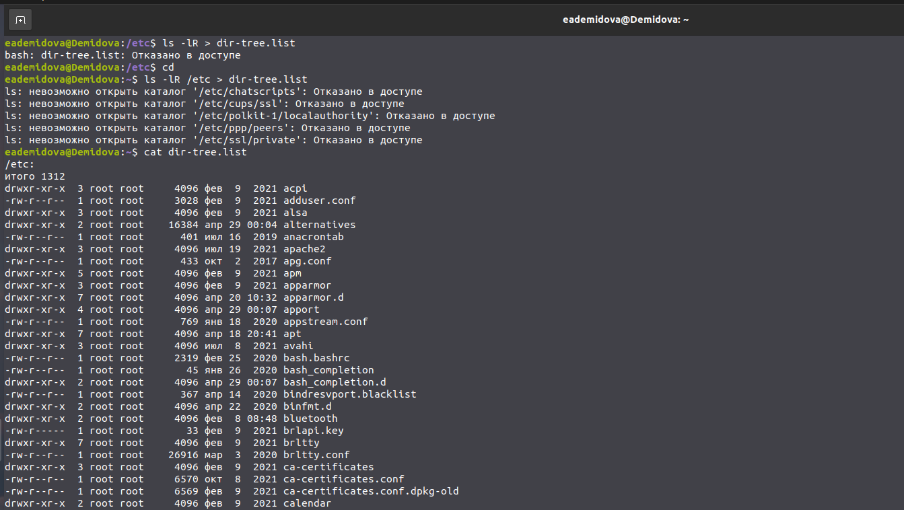{ #fig:001 width=70% }

Допишем в этот же файл названия файлов, содержащихся в домашнем каталоге с помощью команды ls -lR >> dir-tree.list (рис. [-@fig:002])

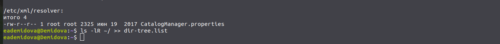{ #fig:002 width=70% }

Выведим имена всех файлов из file.txt, имеющих расширение .conf, после чего
запишем их в новый текстовой файл conf.txt. (рис. [-@fig:003])

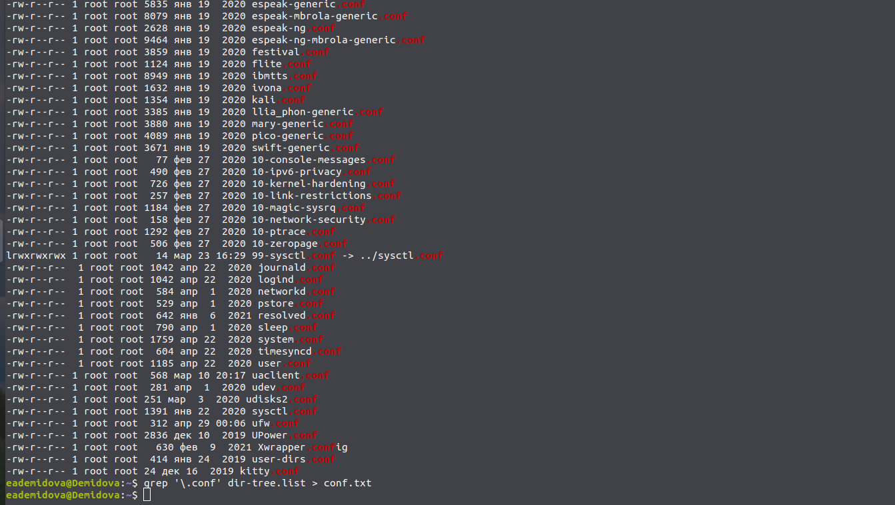{ #fig:003 width=70% }

Определим, какие файлы в домашнем каталоге имеют имена, начинавшиеся
с символа c помощью команд find и grep (рис. [-@fig:004;-@fig:005]))

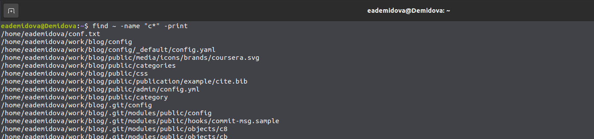{ #fig:004 width=70% }

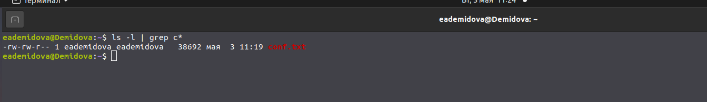{ #fig:005 width=70% }

Выведем на экран (по странично) имена файлов из каталога /etc, начинающиеся
с символа h с помощью команды find. (рис. [-@fig:006])

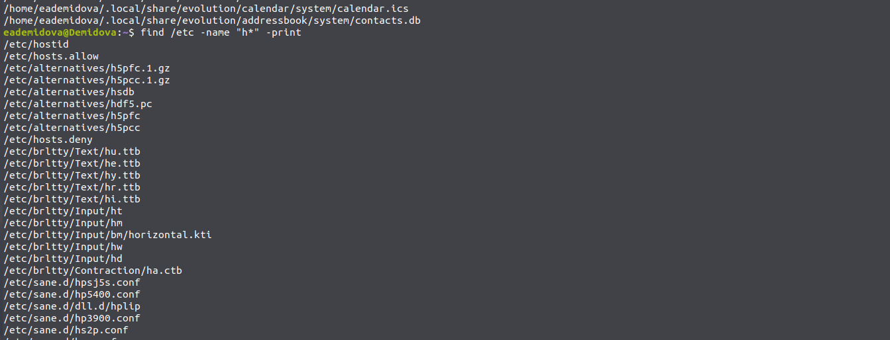{ #fig:006 width=70% }


Запустим в фоновом режиме процесс, который будет записывать в файл ~/logfile
файлы, имена которых начинаются с log. Затем удалим файл ~/logfile. (рис. [-@fig:007])

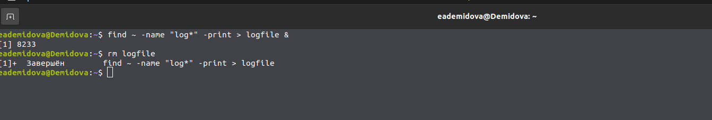{ #fig:007 width=70% }

Запустим из консоли в фоновом режиме редактор gedit(рис. [-@fig:008])

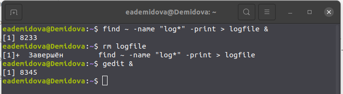{ #fig:008 width=70% }

Определим идентификатор процесса gedit, используя команду ps, конвейер и фильтр
grep.(рис. [-@fig:009])

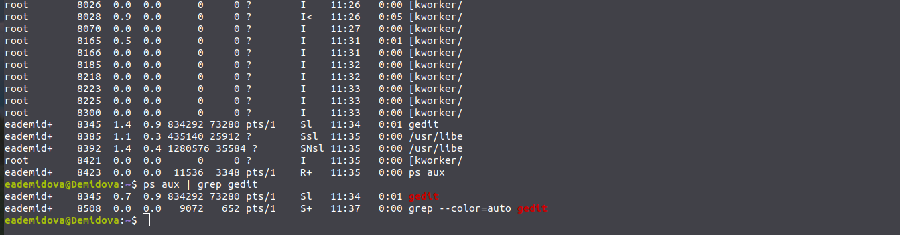{ #fig:009 width=70% }

Прочтем справку (man) команды kill, после чего используем её для завершения
процесса gedit. (рис. [-@fig:010])

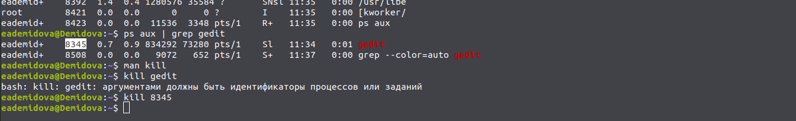{ #fig:010 width=70% }

Выполним команды df и du, предварительно получив более подробную информацию
об этих командах, с помощью команды man. (рис. [-@fig:011;-@fig:012])

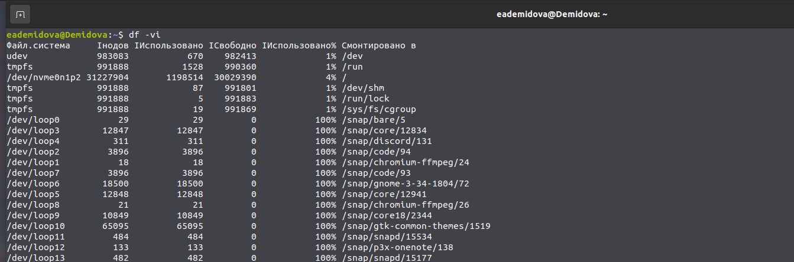{ #fig:011 width=70% }

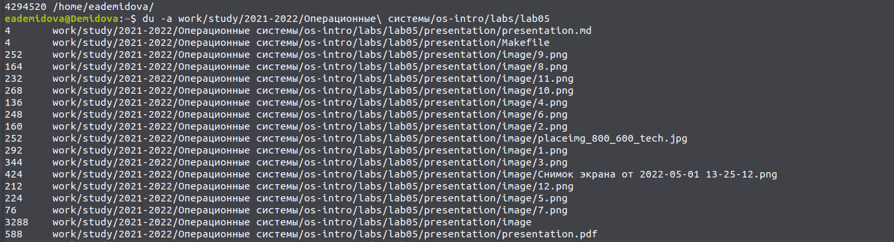{ #fig:012 width=70% }

Воспользовавшись справкой команды find , выведим имена всех директорий, имеющихся в вашем домашнем каталоге (рис. [-@fig:013])

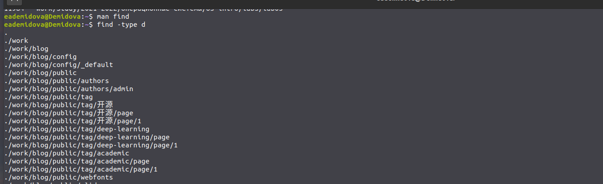{ #fig:013 width=70% }


# Выводы

В результате выполнения лабораторной работы ознакомилась с инструментами поиска файлов и фильтрации текстовых данных. Приобретела практические навыки: по управлению процессами (и заданиями), по проверке использования диска и обслуживанию файловых систем.

# Контрольные вопросы

1. Какие потоки ввода вывода вы знаете?

В системе по умолчанию открыто три специальных потока:
– stdin — стандартный поток ввода (по умолчанию: клавиатура), файловый дескриптор
0;
– stdout — стандартный поток вывода (по умолчанию: консоль), файловый дескриптор
1;
– stderr — стандартный поток вывод сообщений об ошибках (по умолчанию: консоль),
файловый дескриптор 2.

2. Объясните разницу между операцией > и >>.

> - перенаправление вывода/ввода, а >> -перенаправление в режиме добавления

3. Что такое конвейер?

Конвейер (pipe) служит для объединения простых команд или утилит в цепочки, в ко-
торых результат работы предыдущей команды передаётся последующей. 

4. Что такое процесс? Чем это понятие отличается от программы?

главное отличие между программой и процессом заключается в том, что Программа - это набор инструкций, который позволяет ЦПУ выполнять определенную задачу, в то время как процесс - это исполняемая программа.

5. Что такое PID и GID?

Process IDentifier, PID) — уникальный номер (идентификатор) процесса в многозадачной операционной системе (ОС)

Идентификатор группы, часто сокращенно GID, представляет собой числовое значение, используемое для представления определенной группы. … Это числовое значение используется для обозначения групп в файлах / etc / passwd и / etc / group или их эквивалентах. Файлы теневых паролей и Сетевая информационная служба также относятся к числовым GID.

6. Что такое задачи и какая команда позволяет ими управлять?

Запущенные фоном программы называются задачами (jobs). Ими можно управлять с помощью команды jobs, которая выводит список запущенных в данный момент задач

7. Найдите информацию об утилитах top и htop. Каковы их функции?

top - позволяет выводить информацию о системе, а также список процессов динамически обновляя информацию о потребляемых ими ресурсах. Команда htop похожа на команду top по выполняемой функции: они обе показывают информацию о процессах в реальном времени, выводят данные о потреблении системных ресурсов и позволяют искать, останавливать и управлять процессами. В программе htop реализован очень удобный поиск по процессам, а также их фильтрация.

8. Назовите и дайте характеристику команде поиска файлов. Приведите примеры ис-
пользования этой команды.

Команда find используется для поиска и отображения имён файлов, соответствующих заданной строке символов. Формат команды: find путь [-опции] Путь определяет каталог, начиная с которого по всем подкаталогам будет вестисьпоиск. Пример: Вывести на экран имена файлов из вашего домашнего каталога и его подкаталогов, начинающихся на f: find ~ -name "f*" -print где ~ — обозначение вашего домашнего каталога, -name — после этой опции указывается имя файла, который нужно найти, "f*" — строка символов, определяющая имя файла, -print — опция, задающая вывод результатов поиска на экран.


9. Можно ли по контексту (содержанию) найти файл? Если да, то как?

`find -type f -exec grep -H 'текстДляПоиска'`
 
10. Как определить объем свободной памяти на жёстком диске?

Определить объем свободной памяти на жёстком диске можно с помощьюdf -h

11. Как определить объем вашего домашнего каталога?

Определить объем домашнего каталога можно командой du -s

12. Как удалить зависший процесс?

Для завершения процесса необходимо выполнить команду kill %номер задач

# Список литературы{.unnumbered}

::: {#refs}
:::
