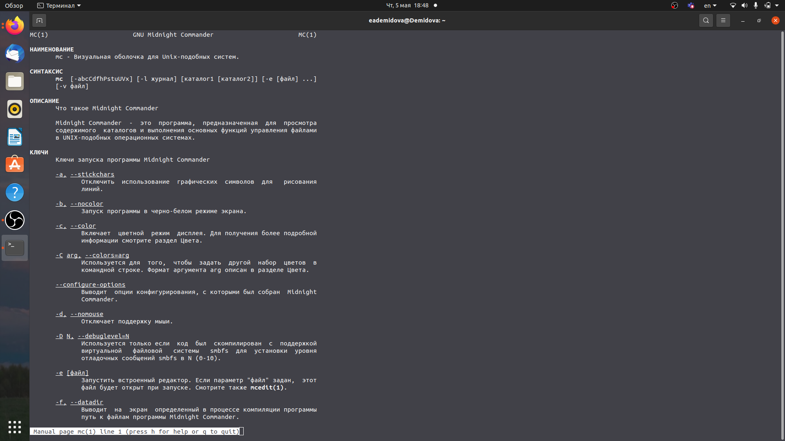
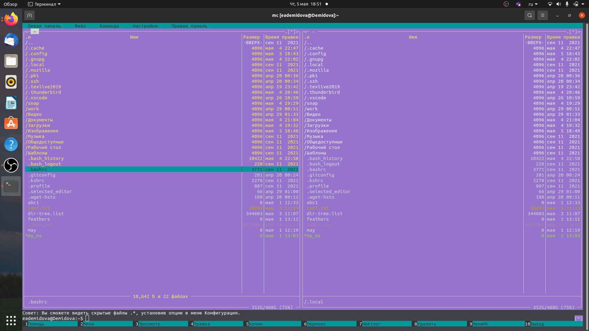
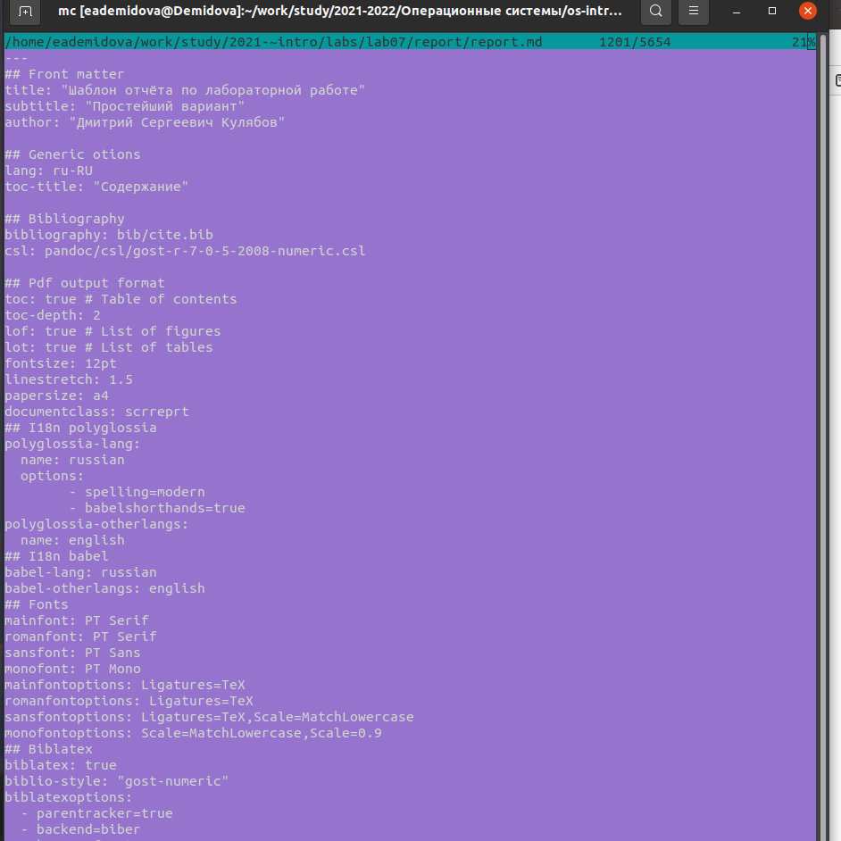
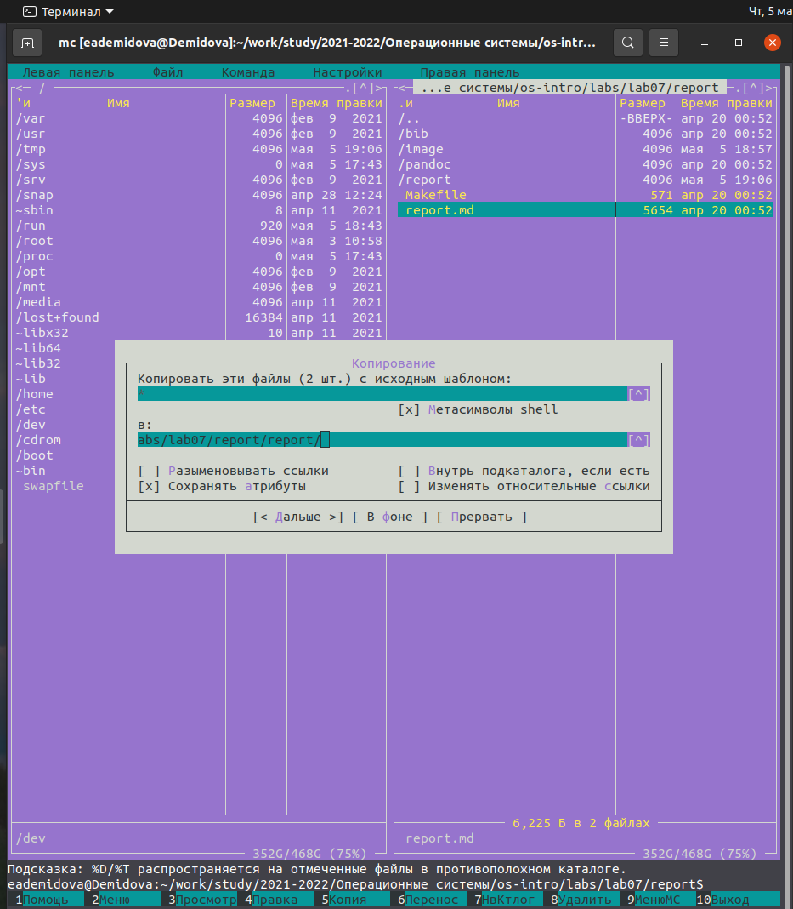
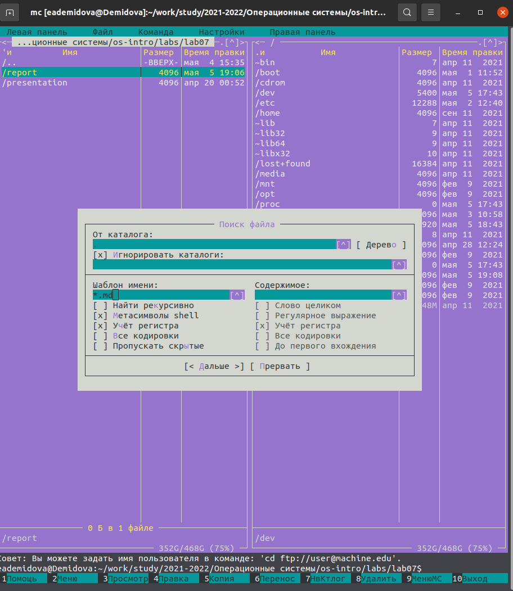
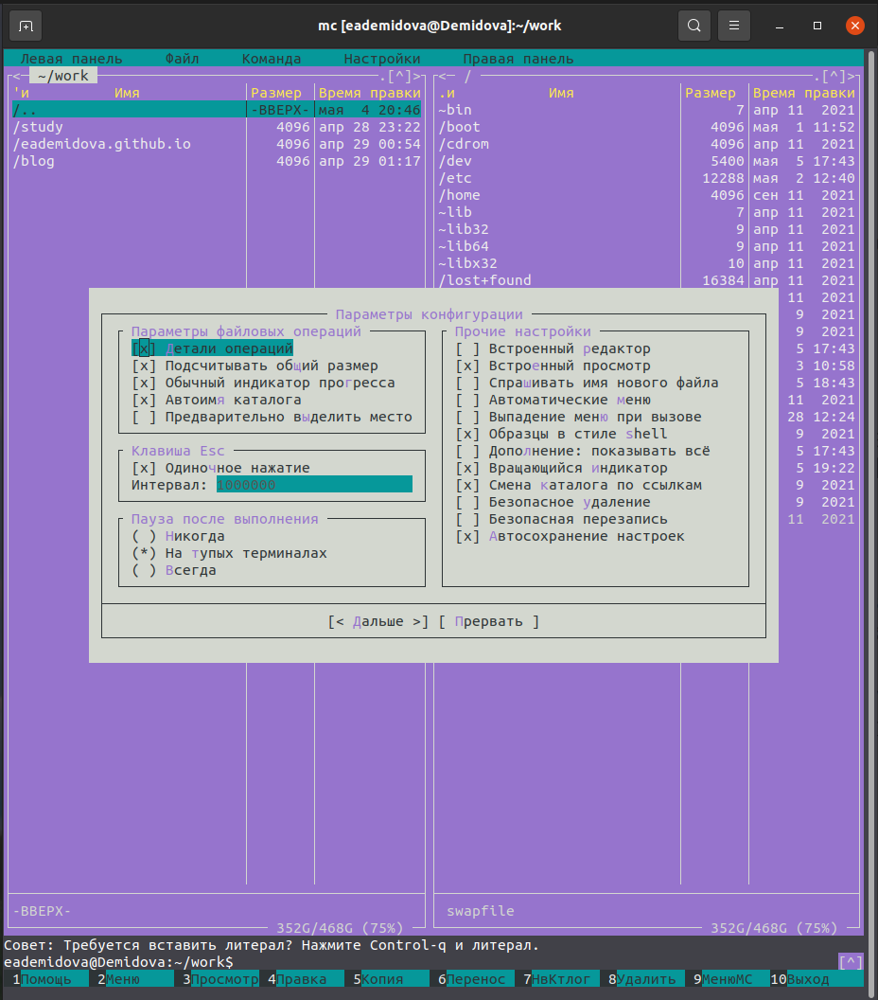
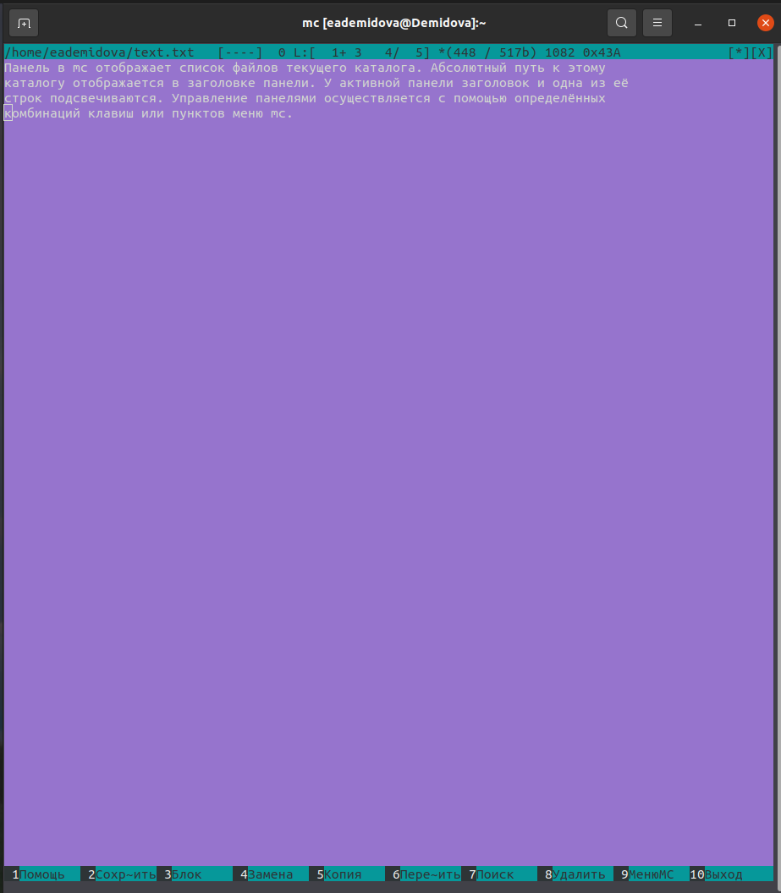
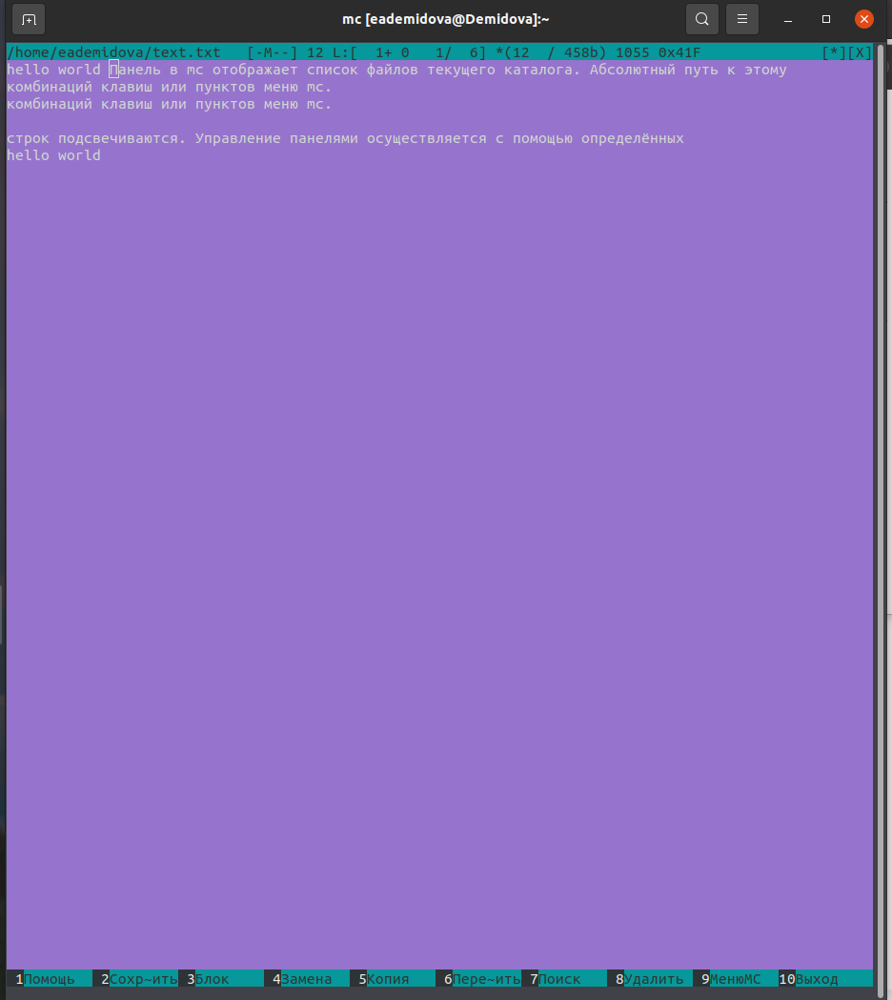
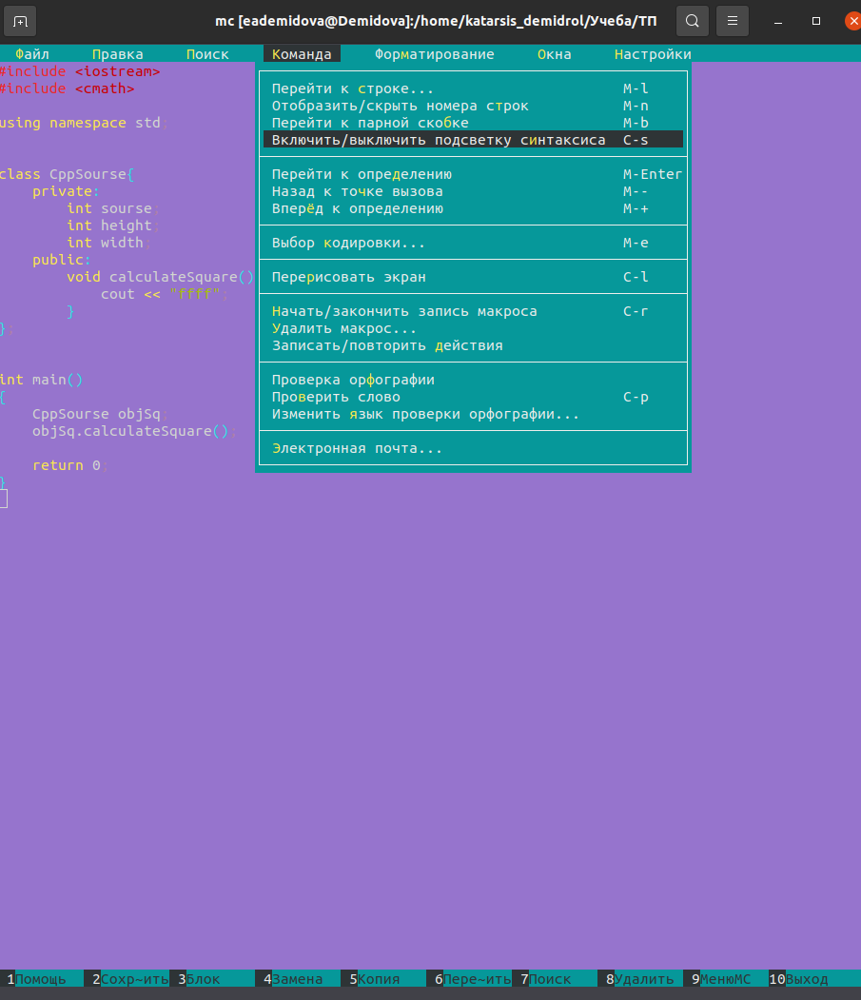

---
## Front matter
lang: ru-RU
title: Лабораторная работа №7
author: |
	Демидова Е.А.
institute: Российский Университет дружбы народов
date: Операционные системы -- 2022

## Formatting
toc: false
slide_level: 2
theme: metropolis
header-includes: 
 - \metroset{progressbar=frametitle,sectionpage=progressbar,numbering=fraction}
 - '\makeatletter'
 - '\beamer@ignorenonframefalse'
 - '\makeatother'
aspectratio: 43
section-titles: true
---

# Введение

## Введение

**Цель работы**

Освоение основных возможностей командной оболочки Midnight Commander. Приоб-
ретение навыков практической работы по просмотру каталогов и файлов; манипуляций
с ними.

**Задачи**

- Изучение информации о mc.

- Практическая работа с mc.

- Изучить горячие клавиши mcedit.

- Научиться работать с файлами с помощью mcedit.

# Результаты работы

## Задание по mc

Изучила  информацию о mc, вызвав в командной строке man mc.
{ #fig:001 width=70% }

## Задание по mc

Запустила из командной строки mc, изучила его структуру и меню. Выполнила несколько операций в mc, используя управляющие клавиши. Проведем операции
с панелями; выделение/отмена выделения файлов (insert), копирование/перемещение файлов(f5 и f6), 
получение информации о размере и правах доступа на каталоги
{ #fig:002 width=60% }

## Задание по mc

Выполнила основные команды меню левой панели. Посмотрела дерево директорий и информацию о файле.
Используя возможности подменю Файл , выполнила просмотр содержимого текстового файла.
{ #fig:008 width=65% }

## Задание по mc

Затем выполнила редактирование содержимого текстового файла (без сохранения результатов
редактирования). Затем создала каталог, скопировала файлы в созданный каталог.
{ #fig:011 width=65% }

## Задание по mc
С помощью соответствующих средств подменю Команда осуществила поиск в файловой системе файла с заданными условиями
{ #fig:013 width=65% }

## Задание по mc

Затем выберала команду поиска и повторила её, перешла в домашний каталог, провела анализ файла меню и файла расширений.
Вызвала подменю Настройки. Освоила операции, определяющие структуру экрана mc посмотрев внешний вид и параметры конфигурации
{ #fig:019 width=65% }

## Задание по встроенному редактору mc

Создадала текстовый файл text.txt и открыла этот файл с помощью встроенного в mc редактора, написав в терминале mc.
{ #fig:021 width=65% }

## Задание по встроенному редактору mc

Удалила строку из текста с помощью горячей клавиши ctrl+y.Скопировала строку с помощью горячей клавиши F5. Переместила строку с помощью горячей клавиши F6. 
Затем сохранила файл нажав F2 и с помощьью горячей клавиши ctrl+U отменила это действие. Дополнила файл в начале и в конце перейдя туда с помощью горячих клавиш ctrl+end и ctrl+home. 
Затем Сохранимла файл нажав F2 и закрыла с помощью F10
{ #fig:025 width=60% }

## Задание по встроенному редактору mc

Открыла файл на языке c++ и выключим подсветку текста.
{ #fig:026 width=65% }

## Выводы

Освоила основные возможности командной оболочки Midnight Commander. Приобрела навыки практической работы по просмотру каталогов и файлов; манипуляций с ними.

## Список литературы

1. GNU Bash Manual [Электронный ресурс]. Free Software Foundation, 2016.
URL: https://midnight-commander.org/.

## {.standout}

Спасибо за внимание
