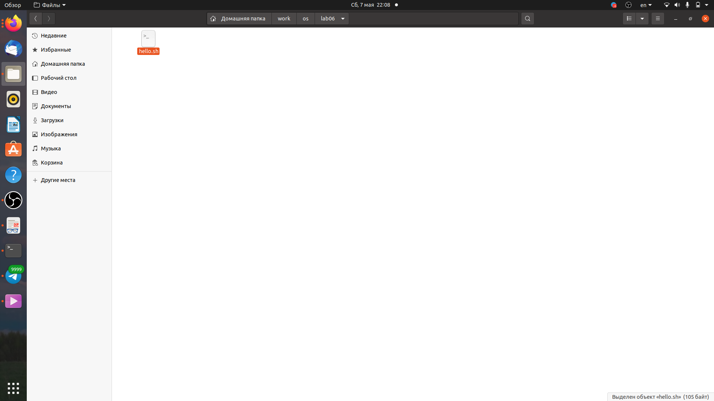
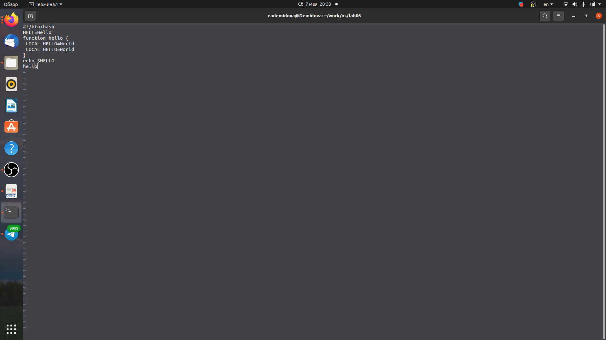
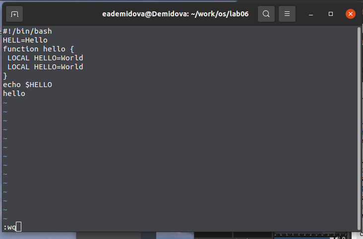
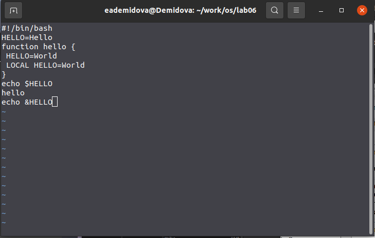
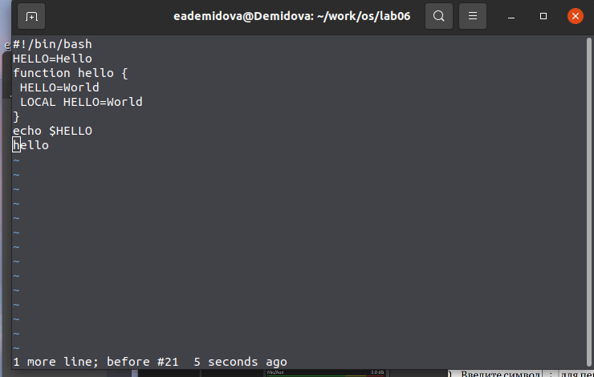
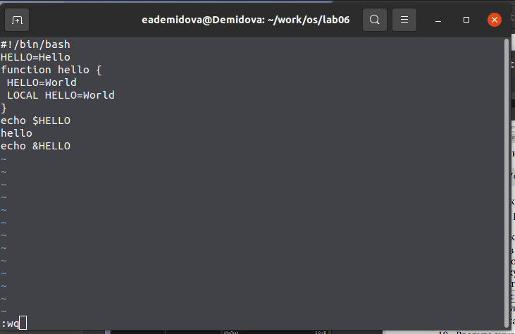

---
## Front matter
lang: ru-RU
title: Лабораторная работа №8
author: |
	Демидова Е.А.
institute: Российский Университет дружбы народов
date: Операционные системы -- 2022

## Formatting
toc: false
slide_level: 2
theme: metropolis
header-includes: 
 - \metroset{progressbar=frametitle,sectionpage=progressbar,numbering=fraction}
 - '\makeatletter'
 - '\beamer@ignorenonframefalse'
 - '\makeatother'
aspectratio: 43
section-titles: true
---

# Введение

## Введение

**Цель работы**

Познакомиться с операционной системой Linux. Получить практические навыки рабо-
ты с редактором vi, установленным по умолчанию практически во всех дистрибутивах.

**Задачи**

- Изучить основные функции текстового редактора vi

- Создать файл с помощью vi

- Отредактировать файл с помощью vi

# Результаты работы

# Задание 1

## Создание файла

Создадим каталог с именем ~/work/os/lab06 с помощью команды mkdir. Затем перейлем в него с помощью команды cd. С помощью команды vi hello.sh создадим файл и автоматически откроем его в текстовом редакторе vi.
{ #fig:001 width=70% }

## Запис текста в файл

Нажмем клавишу i и введём текст данный в лабораторной работе.
{ #fig:002 width=70% }

## Выход и схранение

Затем нажмём клавишу esc для перехода в командный режим и нажмем : для перехода в режим последней строки и внизу экрана после двоеточия напишем wq для сохрания текста и завершения работы.
{ #fig:003 width=70% }

Сделаем файл исполняемым с помощью команды chmod +x hello.sh.

# Задание 2

## Редактирование файла

Вызовем vi для редактирования файла с помощью команды vi ~/work/os/lab06/hello.sh. Затем установим курсор в конец слова HELL второй строки и, перейдя в режим вставки с помощью клавиш esc и a, заменим его на HELLO. Затем перейдем в командный режим и перейдём на четвертую строку, сотрем слово с помощью клавиши dw LOCAL. С помощью клавиш esc и a перейдем в режим вставки и напишем вместо него local. Затем снова перейдем в командный режим и установим курсор на последней строке файла. Вставим строку echo &HELLO.
{ #fig:004 width=60% }

## Удаление строки

Удалим строку с помощью нажатия dd.
{ #fig:005 width=70% }

## Сохранение и выход

Затем вернём эту строку с помощью клавиши u. Перейдя в режим последней строки с помощью нажатия : сохраним файл и выйдем.
{ #fig:006 width=70% }

## Выводы

В результате выполнения лабораторной работы познакомилась с операционной системой Linux. Получила практические навыки работы с редактором vi, установленным по умолчанию практически во всех дистрибутивах.

## Список литературы
1. Белецкий Б. Linux. Руководство начинающего пользователя. GNU General
Public License, 1998. 354 с.

## {.standout}

Спасибо за внимание
