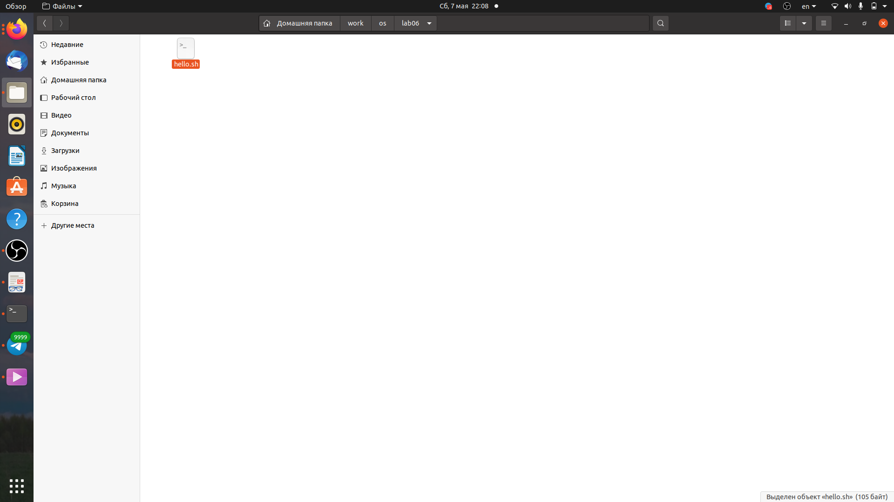
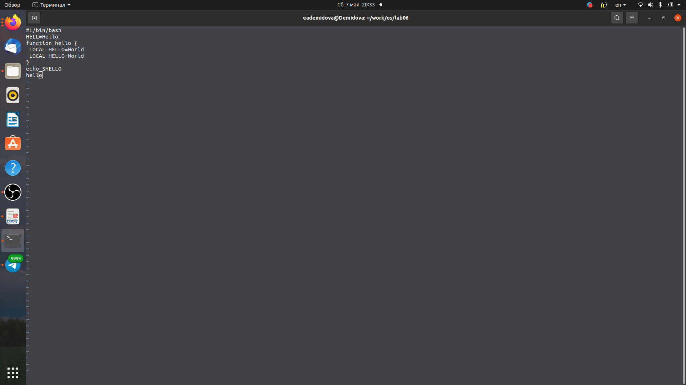
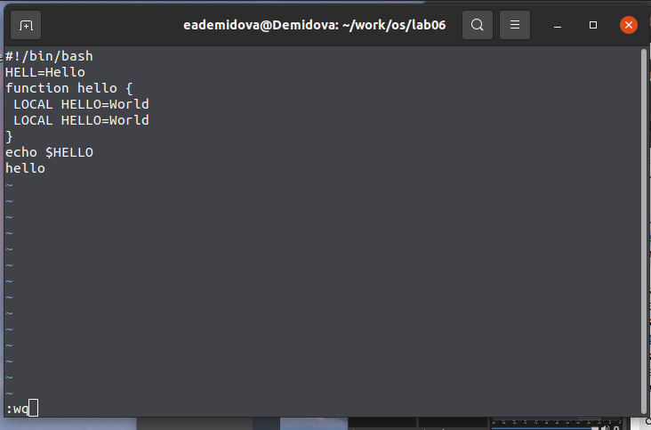
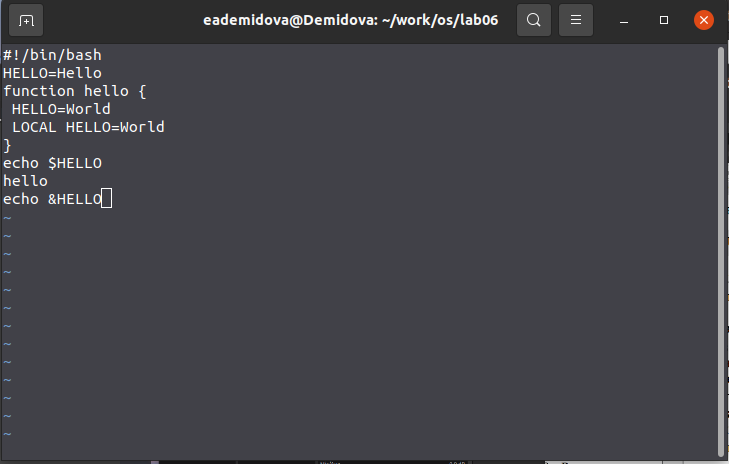
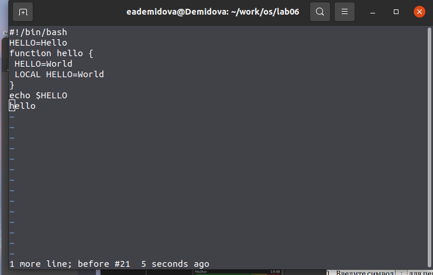
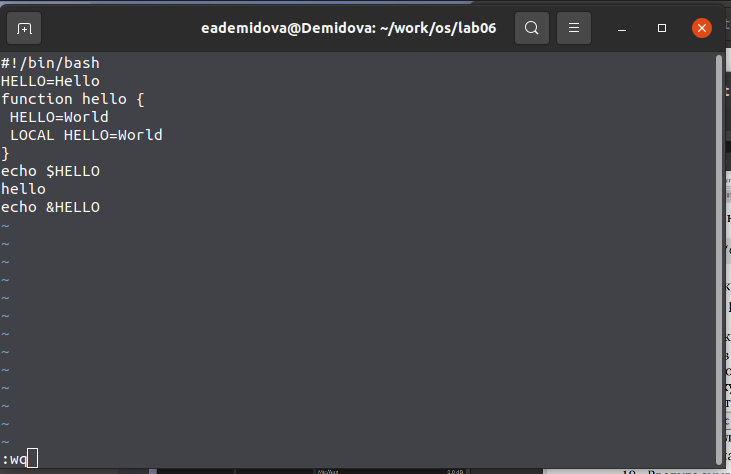

---
## Front matter
title: "Лабораторная работа №8"
subtitle: "Редактирование существующего файла"
author: "Демидова Екатерина Алексеевна"

## Generic otions
lang: ru-RU
toc-title: "Содержание"

## Bibliography
bibliography: bib/cite.bib
csl: pandoc/csl/gost-r-7-0-5-2008-numeric.csl

## Pdf output format
toc: true # Table of contents
toc-depth: 2
lof: true # List of figures
lot: false # List of tables
fontsize: 12pt
linestretch: 1.5
papersize: a4
documentclass: scrreprt
## I18n polyglossia
polyglossia-lang:
  name: russian
  options:
	- spelling=modern
	- babelshorthands=true
polyglossia-otherlangs:
  name: english
## I18n babel
babel-lang: russian
babel-otherlangs: english
## Fonts
mainfont: PT Serif
romanfont: PT Serif
sansfont: PT Sans
monofont: PT Mono
mainfontoptions: Ligatures=TeX
romanfontoptions: Ligatures=TeX
sansfontoptions: Ligatures=TeX,Scale=MatchLowercase
monofontoptions: Scale=MatchLowercase,Scale=0.9
## Biblatex
biblatex: true
biblio-style: "gost-numeric"
biblatexoptions:
  - parentracker=true
  - backend=biber
  - hyperref=auto
  - language=auto
  - autolang=other*
  - citestyle=gost-numeric
## Pandoc-crossref LaTeX customization
figureTitle: "Рис."
tableTitle: "Таблица"
listingTitle: "Листинг"
lofTitle: "Список иллюстраций"
lotTitle: "Список таблиц"
lolTitle: "Листинги"
## Misc options
indent: true
header-includes:
  - \usepackage{indentfirst}
  - \usepackage{float} # keep figures where there are in the text
  - \floatplacement{figure}{H} # keep figures where there are in the text
---

# Цель работы

Познакомиться с операционной системой Linux. Получить практические навыки рабо-
ты с редактором vi, установленным по умолчанию практически во всех дистрибутивах.

# Задание

**Задание 1.** Создание нового файла с использованием vi
1. Создайте каталог с именем ~/work/os/lab06.
2. Перейдите во вновь созданный каталог.
3. Вызовите vi и создайте файл hello.sh.
4. Нажмите клавишу i и вводите следующий текст.
5. Нажмите клавишу Esc для перехода в командный режим после завершения ввода
текста.
6. Нажмите : для перехода в режим последней строки и внизу вашего экрана появится
приглашение в виде двоеточия.
7. Нажмите w (записать) и q (выйти), а затем нажмите клавишу Enter для сохранения
вашего текста и завершения работы.
8. Сделайте файл исполняемым

**Задание 2.** Редактирование существующего файла
1. Вызовите vi на редактирование файла.
2. Установите курсор в конец слова HELL второй строки.
3. Перейдите в режим вставки и замените на HELLO. Нажмите Esc для возврата в команд-
ный режим.
4. Установите курсор на четвертую строку и сотрите слово LOCAL.
5. Перейдите в режим вставки и наберите следующий текст: local, нажмите Esc для
возврата в командный режим.
6. Установите курсор на последней строке файла. Вставьте после неё строку, содержащую
следующий текст: echo $HELLO.
7. Нажмите Esc для перехода в командный режим.
8. Удалите последнюю строку.
9. Введите команду отмены изменений u для отмены последней команды.
10. Введите символ : для перехода в режим последней строки. Запишите произведённые
изменения и выйдите из vi.

# Теоретическое введение

 Текстовым редактором (text editor) называют программу, которая предназначена для редактирования (составления и изменения) файлов, 
содержащих только текст, например: письмо, программа на языке C, системный конфигурационный файл. 
При том, что имеется много различных редакторов для системы Linux, единственный, чьё присутствие будет гарантировано в любой системе UNIX или Linux
— это vi (visual editor).
При запуске редактора vi вы оказываетесь в командном режиме. В этом режиме можно давать команды для редактирования файлов или перейти в другой режим. Например, вводя x в командном режиме мы удаляем символ, на который указывает курсор. Клавиши-стрелки перемещают курсор по редактируемому файлу. Как правило, команды, используемые в командном режиме, состоят из одного или двух символов.

 Основной ввод и редактирование текста осуществляется в режиме ввода. При использовании редактора vi основное время, скорее всего, 
будет проводиться именно в этом режиме. Переход в режим ввода из командного режима осуществляется командой i (от слова insert). Находясь в режиме ввода, можно вводить текст в то место, 
куда указывает курсор. Выход из режима ввода в командный режим осуществляется клавишей Esc.

 Режим последней строки═— это специальный режим, в котором редактору даются сложные команды. При вводе этих команд они отображаются в последней 
строке экрана (отсюда пошло название режима). Например, если ввести в командном режиме команду :, то осуществится переход в режим последней строки, 
и можно будет вводить такие команды, как wq (записать файл и покинуть редактор vi) или q! (выйти из редактора vi без сохранения изменений). В режиме последней строки обычно вводятся команды, название которых состоит из нескольких символов. В этом режиме в последнюю строку вводится команда, после чего нажимается клавиша Enter, и команда исполняется.[@linux:1998:bash].

# Выполнение лабораторной работы

## Задание 1

Создадим каталог с именем ~/work/os/lab06 с помощью команды mkdir. Затем перейлем в него с помощью команды cd. С помощью команды vi hello.sh создадим файл и автоматически откроем его в текстовом редакторе vi (рис. [-@fig:001])

{ #fig:001 width=70% }

Нажмем клавишу i и введём текст данный в лабораторной работе. (рис. [-@fig:002])

{ #fig:002 width=70% }

Затем нажмём клавишу esc для перехода в командный режим и нажмем : для перехода в режим последней строки и внизу экрана после двоеточия напишем wq для сохрания текста и завершения работы.(рис. [-@fig:003])

{ #fig:003 width=70% }

Сделаем файл исполняемым с помощью команды chmod +x hello.sh.

## Задание 2

Вызовем vi для редактирования файла с помощью команды vi ~/work/os/lab06/hello.sh. Затем установим курсор в конец слова HELL второй строки и, перейдя в режим вставки с помощью клавиш esc и a, заменим его на HELLO. Затем перейдем в командный режим и перейдём на четвертую строку, сотрем слово с помощью клавиши dw LOCAL. С помощью клавиш esc и a перейдем в режим вставки и напишем вместо него local. Затем снова перейдем в командный режим и установим курсор на последней строке файла. Вставим строку echo &HELLO. (рис. [-@fig:004])

{ #fig:004 width=70% }

Удалим строку с помощью нажатия dd. (рис. [-@fig:005])

{ #fig:005 width=70% }

Затем вернём эту строку с помощью клавиши u. Перейдя в режим последней строки с помощью нажатия : сохраним файл и выйдем. (рис. [-@fig:006])

{ #fig:006 width=70% }

# Контрольные вопросы

1. Редактор vi имеет три режима работы:

- командный режим — предназначен для ввода команд редактирования и навигации по редактируемому файлу;
- режим вставки — предназначен для ввода содержания редактируемого файла;
- режим последней (или командной) строки — используется для записи изменений в файл и выхода из редактора.

2. Можно нажимать символ q (или q!), если требуется выйти из редактора без сохранения.
3. Команды позиционирования:
- 0 (ноль) — переход в начало строки;
- $ — переход в конец строки;
- G — переход в конец файла;
- nG — переход на строку с номером n
4. Редактор vi предполагает, что слово - это строка символов, которая может включать в себя буквы, цифры и символы подчеркивания.
5. G — переход в конец файла
6. Команды редактирования:
 
- Вставка текста – а — вставить текст после курсора; – А — вставить текст в конец строки; – i — вставить текст перед курсором; – n i — вставить текст n раз; – I — вставить текст в начало строки.
- Вставка строки – о — вставить строку под курсором; – О — вставить строку над курсором.
- Удаление текста – x — удалить один символ в буфер; – d w — удалить одно слово в буфер; – d $ — удалить в буфер текст от курсора до конца строки; – d 0 — удалить в буфер текст от начала строки до позиции курсора; – d d — удалить в буфер одну строку; – n d d — удалить в буфер n строк.
- Отмена и повтор произведённых изменений – u — отменить последнее изменение; – . — повторить последнее изменение.
- Копирование текста в буфер – Y — скопировать строку в буфер; – n Y — скопировать n строк в буфер; – y w — скопировать слово в буфер.
- Вставка текста из буфера – p — вставить текст из буфера после курсора; – P — вставить текст из буфера перед курсором.
- Замена текста – c w — заменить слово; – n c w — заменить n слов; – c $ — заменить текст от курсора до конца строки; – r — заменить слово; – R — заменить текст.
- Поиск текста – / текст — произвести поиск вперёд по тексту указанной строки символов текст; – ? текст — произвести поиск назад по тексту указанной строки символов текст.
7. $ — переход в конец строки
8. u — отменить последнее изменение
9. Режим последней строки — используется для записи изменений в файл и выхода из редактора.
10. $ — переход в конец строки
11. Опции редактора vi позволяют настроить рабочую среду. Для задания опций используется команда set (в режиме последней строки): – : set all — вывести полный список опций; – : set nu — вывести номера строк; – : set list — вывести невидимые символы; – : set ic — не учитывать при поиске, является ли символ прописным или строчным.
12. В редакторе vi есть два основных режима: командный режим и режим вставки. По умолчанию работа начинается в командном режиме. В режиме вставки клавиатура используется для набора текста. Для выхода в командный режим используется клавиша Esc или комбинация Ctrl + c 
    
# Выводы

В результате выполнения лабораторной работы познакомилась с операционной системой Linux. Получила практические навыки работы с редактором vi, установленным по умолчанию практически во всех дистрибутивах.

# Список литературы{.unnumbered}

::: {#refs}
:::
