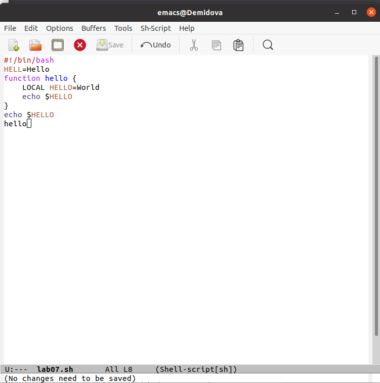
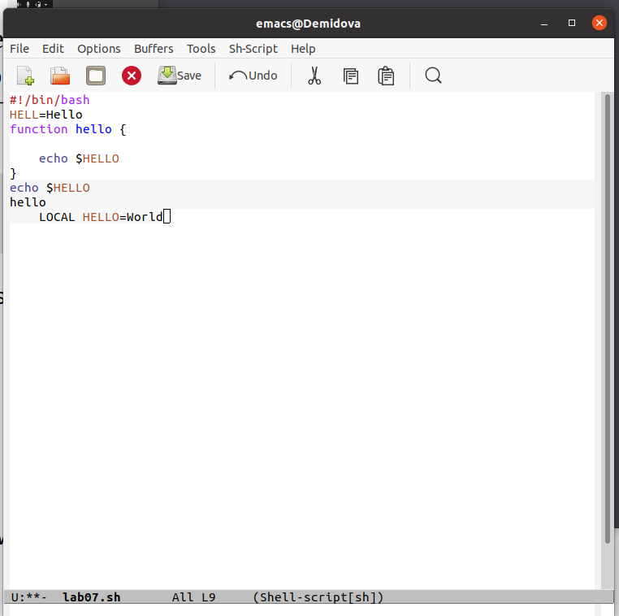
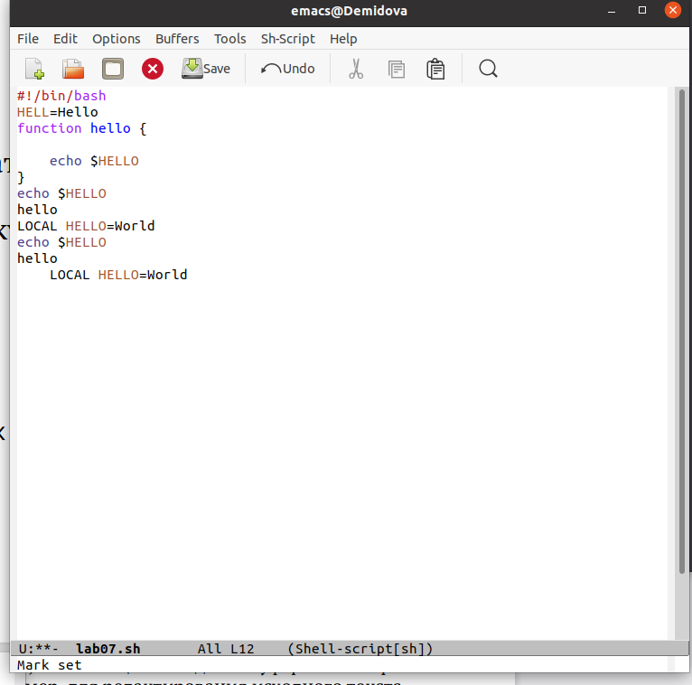
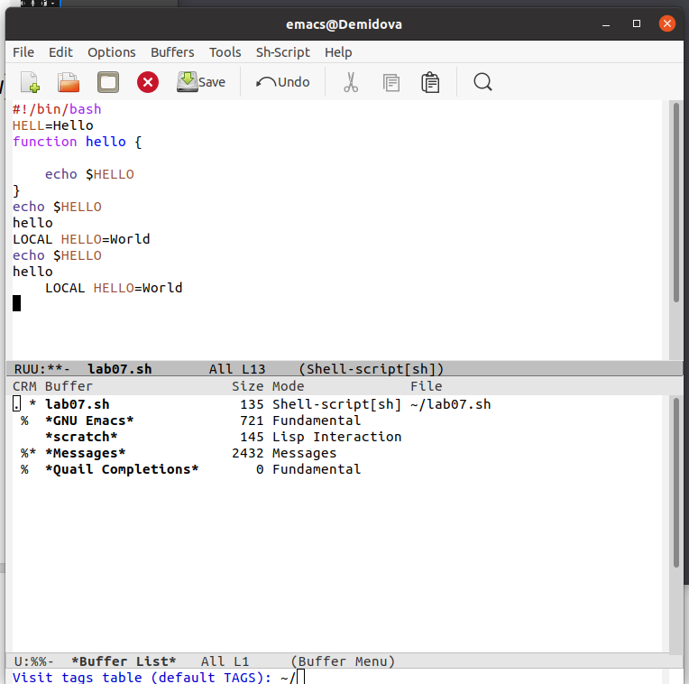
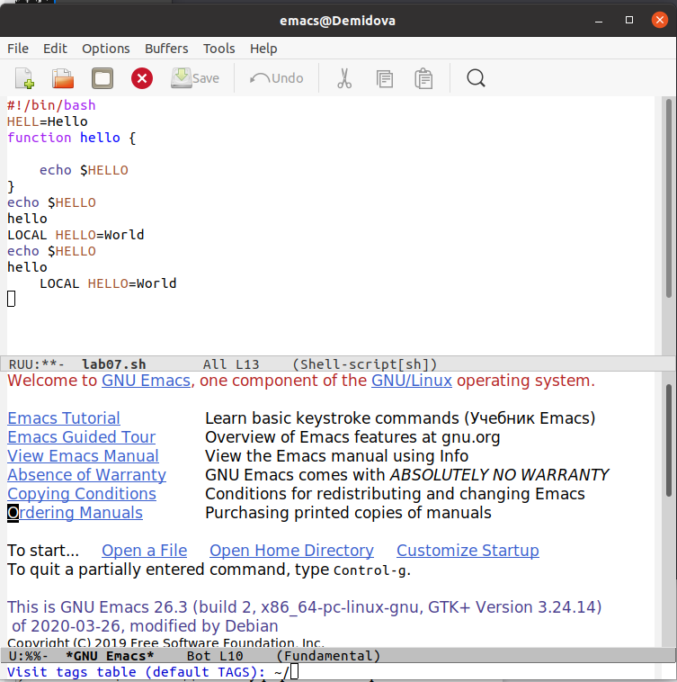
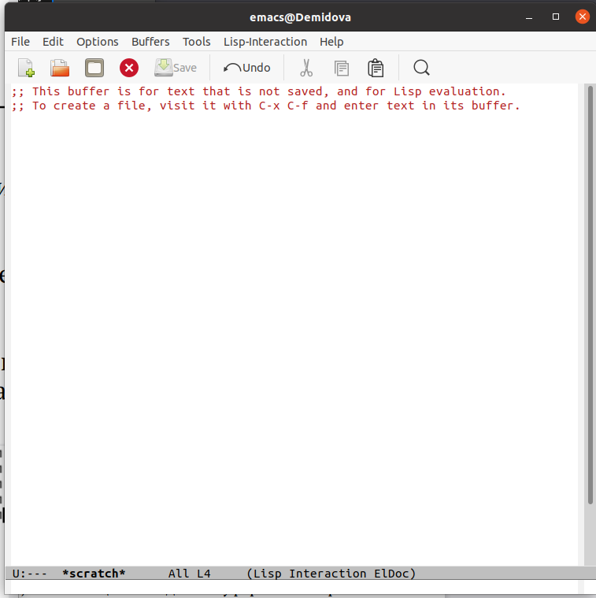
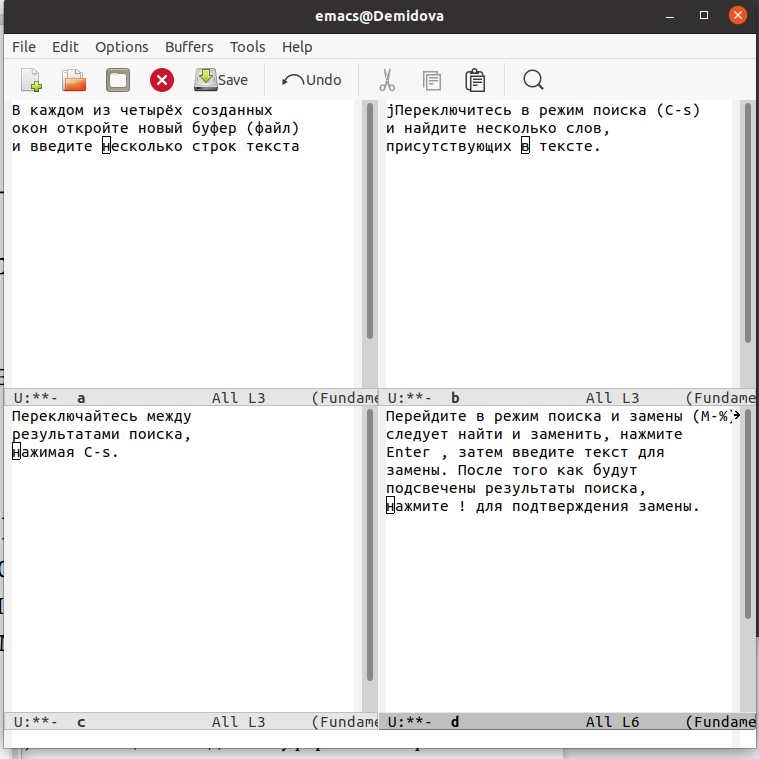
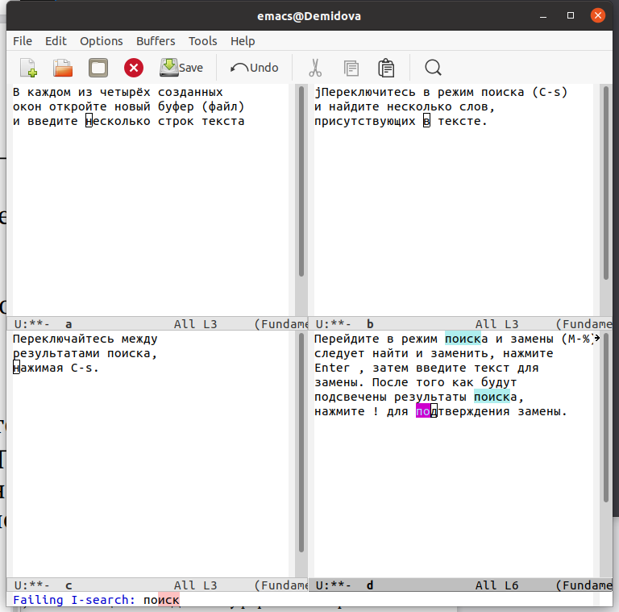
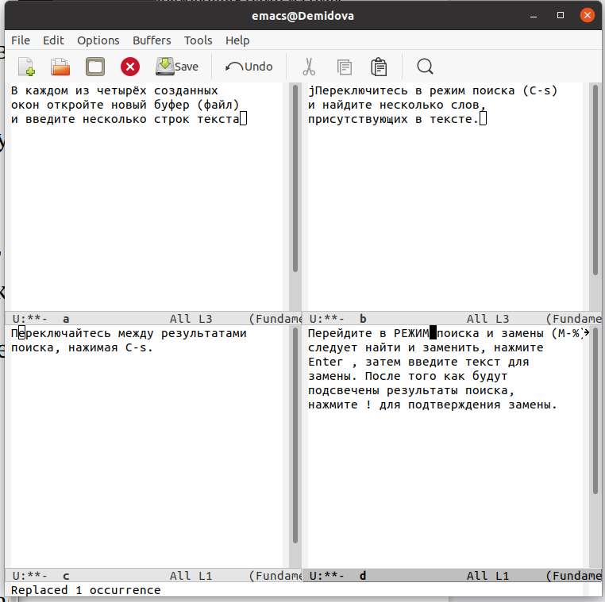
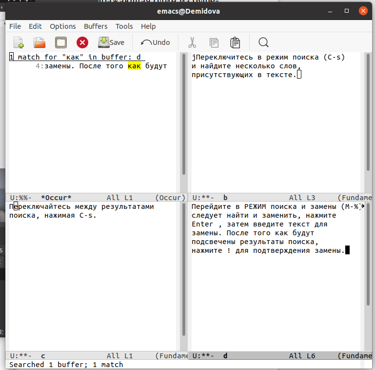

---
## Front matter
lang: ru-RU
title: Лабораторная работа №9
author: |
	Демидова Е.А.
institute: Российский Университет дружбы народов
date: Операционные системы -- 2022

## Formatting
toc: false
slide_level: 2
theme: metropolis
header-includes: 
 - \metroset{progressbar=frametitle,sectionpage=progressbar,numbering=fraction}
 - '\makeatletter'
 - '\beamer@ignorenonframefalse'
 - '\makeatother'
aspectratio: 43
section-titles: true
---

# Введение

## Введение

**Цель работы**

Познакомиться с операционной системой Linux. Получить практические навыки рабо-
ты с редактором Emacs.

**Задачи**

- Изучить основные функции текстового редактора emacs

- Создать файл с помощью emacs

- Отредактировать файл с помощью emacs

- Изучим управление буферами.

- Изучим управление окнами.

- Изучим режим поиска.

# Результаты работы

## Редактирование текста

Откроем emacs. Создадим файл lab07.sh с помощью комбинации Ctrl-x Ctrl-f. Затем введем текст указанный в лабораторной работе
{ #fig:002 width=70% }

## Редактирование текста
Затем сохраним файл с помощью комбинации клавиш Ctrl-x Ctrl-s. Вырежем одной командой (С-k) целую строку LOCAL HELLO=World и вставим её в конец файла(C-y).
{ #fig:003 width=70% }

## Редактирование текста
Выделим область текста (C-space), скопируем область в буфер обмена (M-w) и вставим область в конец файла(C-y). (рис. [-@fig:004])

{ #fig:004 width=70% }

## Команды по перемещению курсора и управление буферами

Переместим курсор в начало строки (C-a). Переместим курсор в конец строки (C-e).Переместим курсор в начало буфера (M-<). Переместим курсор в конец буфера (M->).
Затем выведем список активных буферов на экран (C-x C-b).
{ #fig:009 width=70% }

## Управление буферами

Переместимся во вновь открытое окно (C-x) со списком открытых буферови переключимся на другой буфер.(рис. [-@fig:010])

{ #fig:010 width=70% }

## Управление буферами

Затем закроем это окно (C-x 0) и теперь вновь переключимся между буферами, но уже без вывода их списка на экран (C-x b).(рис. [-@fig:011])
{ #fig:012 width=70% }

## Управление окнами.

Поделим фрейм на 4 части. В каждом из окон откроем новый буфер (файл) и введем
несколько строк текста.
{ #fig:014 width=70% }

## Режим поиска

Переключитесь в режим поиска (C-s) и найдем слово "поиск", присутствующее
в тексте.
{ #fig:015 width=70% }

## Режим поиска

Выйдем из режима поиска, нажав C-g. Перейдем в режим поиска и замены (M-%), введем "режим"
и заменим, нажмите Enter , затем введите текст для замены("РЕЖИМ"). После того как
подсветятся результаты поиска, нажмем ! для подтверждения замены.
{ #fig:016 width=70% }

## Режим поиска

Испробуем другой режим поиска, нажав M-s o. Он отличается от
обычного режима тем, что записывает результат поиска в буфер.
{ #fig:017 width=70% }

## Выводы

В результате выполнения лабораторной работы познакомилась с операционной системой Linux. Получила практические навыки работы с редактором emacs.

## Список литературы
1. Emacs для начинающих [Электронный ресурс]. Alex Ott, 2013. URL: hhttps:
//alexott.net/ru/writings/altlinux-emacs/.

## {.standout}

Спасибо за внимание
