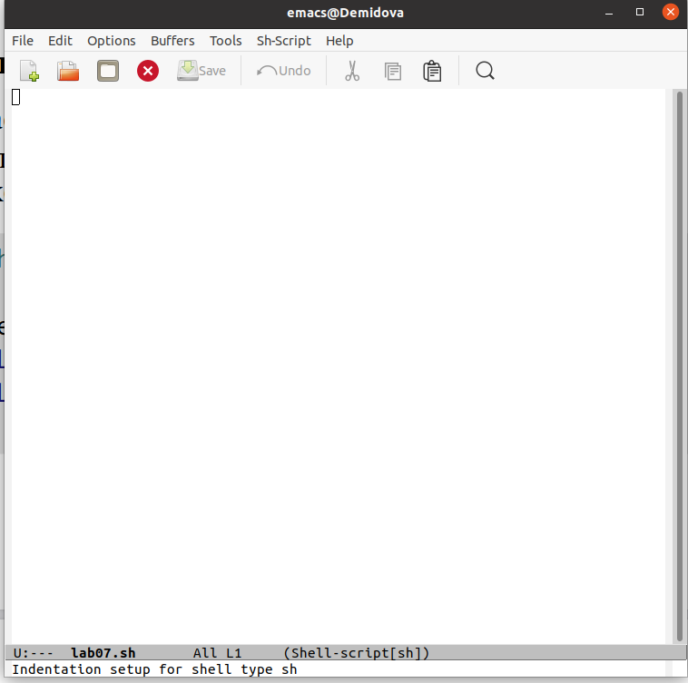

---
## Front matter
title: "Лабораторная работа №9"
subtitle: "Текстовой редактор emacs"
author: "Демидова Екатерина Алексеевна"

## Generic otions
lang: ru-RU
toc-title: "Содержание"

## Bibliography
bibliography: bib/cite.bib
csl: pandoc/csl/gost-r-7-0-5-2008-numeric.csl

## Pdf output format
toc: true # Table of contents
toc-depth: 2
lof: true # List of figures
lot: false # List of tables
fontsize: 12pt
linestretch: 1.5
papersize: a4
documentclass: scrreprt
## I18n polyglossia
polyglossia-lang:
  name: russian
  options:
	- spelling=modern
	- babelshorthands=true
polyglossia-otherlangs:
  name: english
## I18n babel
babel-lang: russian
babel-otherlangs: english
## Fonts
mainfont: PT Serif
romanfont: PT Serif
sansfont: PT Sans
monofont: PT Mono
mainfontoptions: Ligatures=TeX
romanfontoptions: Ligatures=TeX
sansfontoptions: Ligatures=TeX,Scale=MatchLowercase
monofontoptions: Scale=MatchLowercase,Scale=0.9
## Biblatex
biblatex: true
biblio-style: "gost-numeric"
biblatexoptions:
  - parentracker=true
  - backend=biber
  - hyperref=auto
  - language=auto
  - autolang=other*
  - citestyle=gost-numeric
## Pandoc-crossref LaTeX customization
figureTitle: "Рис."
tableTitle: "Таблица"
listingTitle: "Листинг"
lofTitle: "Список иллюстраций"
lotTitle: "Список таблиц"
lolTitle: "Листинги"
## Misc options
indent: true
header-includes:
  - \usepackage{indentfirst}
  - \usepackage{float} # keep figures where there are in the text
  - \floatplacement{figure}{H} # keep figures where there are in the text
---

# Цель работы

Познакомиться с операционной системой Linux. Получить практические навыки рабо-
ты с редактором Emacs.

# Задание

1. Открыть emacs.
2. Создать файл lab07.sh с помощью комбинации Ctrl-x Ctrl-f (C-x C-f).
3. Наберите текст:
4. Сохранить файл с помощью комбинации Ctrl-x Ctrl-s (C-x C-s).
5. Проделать с текстом стандартные процедуры редактирования, каждое действие долж-
но осуществляться комбинацией клавиш.
5.1. Вырезать одной командой целую строку (С-k).
5.2. Вставить эту строку в конец файла (C-y).
5.3. Выделить область текста (C-space).
5.4. Скопировать область в буфер обмена (M-w).
5.5. Вставить область в конец файла.
5.6. Вновь выделить эту область и на этот раз вырезать её (C-w).
5.7. Отмените последнее действие (C-/).
6. Научитесь использовать команды по перемещению курсора.
6.1. Переместите курсор в начало строки (C-a).
6.2. Переместите курсор в конец строки (C-e).
6.3. Переместите курсор в начало буфера (M-<).
6.4. Переместите курсор в конец буфера (M->).
7. Управление буферами.
7.1. Вывести список активных буферов на экран (C-x C-b)
7.2. Переместитесь во вновь открытое окно (C-x) o со списком открытых буферов
и переключитесь на другой буфер.
7.3. Закройте это окно (C-x 0).
7.4. Теперь вновь переключайтесь между буферами, но уже без вывода их списка на
экран (C-x b).
8. Управление окнами.
8.1. Поделите фрейм на 4 части: разделите фрейм на два окна по вертикали (C-x 3),
а затем каждое из этих окон на две части по горизонтали (C-x 2)
8.2. В каждом из четырёх созданных окон откройте новый буфер (файл) и введите
несколько строк текста.
9. Режим поиска
9.1. Переключитесь в режим поиска (C-s) и найдите несколько слов, присутствующих
в тексте.
9.2. Переключайтесь между результатами поиска, нажимая C-s.
9.3. Выйдите из режима поиска, нажав C-g.
9.4. Перейдите в режим поиска и замены (M-%), введите текст, который следует найти
и заменить, нажмите Enter , затем введите текст для замены. После того как будут
подсвечены результаты поиска, нажмите ! для подтверждения замены.
9.5. Испробуйте другой режим поиска, нажав M-s o. Объясните, чем он отличается от
обычного режима?

# Теоретическое введение

 Emacs — один из наиболее мощных и широко распространённых редакторов, используемых в мире Unix. По популярности он соперничает с редактором vi и его клонами. В зависимости от ситуации, Emacs может быть:

- текстовым редактором;
- программой для чтения почты и новостей Usenet;
- интегрированной средой разработки (IDE);
- операционной системой;
- всем, чем угодно.

Всё это разнообразие достигается благодаря архитектуре Emacs, которая позволяет расширять возможности редактора при помощи языка Emacs Lisp. На языке C написаны лишь самые базовые и низкоуровневые части Emacs, включая полнофункциональный интерпретатор языка Lisp. Таким образом, Emacs имеет встроенный язык программирования, который может использоваться для настройки, расширения и изменения поведения редактора. В действительности, большая часть того редактора, с которым пользователи Emacs работают в наши дни, написана на языке Lisp.

Первая версия редактора Emacs была написана в 70-х годах 20-го столетия Richard Stallman (Ричардом Столманом) как набор макросов для редактора TECO. В дальнейшем, уже будучи основателем Фонда Свободного программного обеспечения Free Software Foundation и проекта GNU, Столман разработал GNU Emacs в развитие оригинального Emacs и до сих пор сопровождает эту программу.[@emacs:bash].

# Выполнение лабораторной работы

Откроем emacs. Создадим файл lab07.sh с помощью комбинации Ctrl-x Ctrl-f  (рис. [-@fig:001])

{ #fig:001 width=70% }

Затем введем текст указанный в лабораторной работе (рис. [-@fig:002])

{ #fig:002 width=70% }

Затем сохраним файл с помощью комбинации клавиш Ctrl-x Ctrl-s. Вырежем одной командой (С-k) целую строку LOCAL HELLO=World и вставим её в конец файла(C-y).(рис. [-@fig:003])

{ #fig:003 width=70% }

Выделим область текста (C-space), скопируем область в буфер обмена (M-w) и вставим область в конец файла(C-y). (рис. [-@fig:004])

{ #fig:004 width=70% }

Затем вновь выделим эту область, вырежем и вставим обратно. (рис. [-@fig:005;-@fig:006])

{ #fig:005 width=70% }

{ #fig:006 width=70% }

Переместим курсор в начало строки (C-a). Переместим курсор в конец строки (C-e).Переместим курсор в начало буфера (M-<). Переместим курсор в конец буфера (M->). (рис. [-@fig:007;-@fig:008])

{ #fig:007 width=70% }

{ #fig:008 width=70% }

Выведем список активных буферов на экран (C-x C-b). (рис. [-@fig:009])

{ #fig:009 width=70% }

Переместимся во вновь открытое окно (C-x) со списком открытых буферови переключимся на другой буфер.(рис. [-@fig:010])

{ #fig:010 width=70% }

Затем закроем это окно (C-x 0) и теперь вновь переключимся между буферами, но уже без вывода их списка на экран (C-x b).(рис. [-@fig:011])

{ #fig:011 width=70% }

{ #fig:012 width=70% }

Поделим фрейм на 4 части (рис. [-@fig:013])

{ #fig:013 width=70% }

В каждом из четырёх созданных окон откроем новый буфер (файл) и введем
несколько строк текста. (рис. [-@fig:014])

{ #fig:014 width=70% }

Переключитесь в режим поиска (C-s) и найдем слово "поиск", присутствующее
в тексте.(рис. [-@fig:015])

{ #fig:015 width=70% }

Выйдем из режима поиска, нажав C-g. Перейдем в режим поиска и замены (M-%), введем "режим"
и заменим, нажмите Enter , затем введите текст для замены("РЕЖИМ"). После того как
подсветятся результаты поиска, нажмем ! для подтверждения замены.(рис. [-@fig:016])

{ #fig:016 width=70% }

Испробуем другой режим поиска, нажав M-s o. Он отличается от
обычного режима тем, что записывает результат поиска в буфер (рис. [-@fig:017])

{ #fig:017 width=70% }

# Контрольные вопросы

1. Emacs представляет собой мощный экранный редактор текста, написанный на языке высокого уровня Elisp.
2. Большое количесвто различных комбинаций клавиш.
3. Буфер — объект, представляющий какой-либо текст. Окно — прямоугольная область фрейма, отображающая один из буферов.
4. Можно открыть больше 10 буферов в одном окне.
5. Emacs использует буферы с именами, начинающимися с пробела, для внутренних целей. Отчасти он обращается с буферами с такими именами особенным образом -- например, по умолчанию в них не записывается информация для отмены изменений
6. Ctrl + c, а потом | и Ctrl + c Ctrl + |
7. Разделите фрейм на два окна по вертикали(C-x 3), а затем каждое из этих окон на две части по горизонтали (C-x 2).
8. Настройки emacs хранятся в файле . emacs, который хранится в домашней дирректории пользователя. Кроме этого файла есть ещё папка . emacs.
9. Backspace по умолчанию посимвольно стирает текст справа налево, но её можно переназначить.
10. Удобнее показался emacs, так как есть графическая оболочка и есть возможность переходить по строке и между строк с помощью нажатия мышки или стрелками.

    
# Выводы

В результате выполнения лабораторной работы познакомилась с операционной системой Linux. Получила практические навыки работы с редактором emacs.

# Список литературы{.unnumbered}

::: {#refs}
:::
