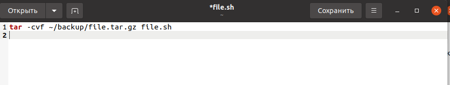
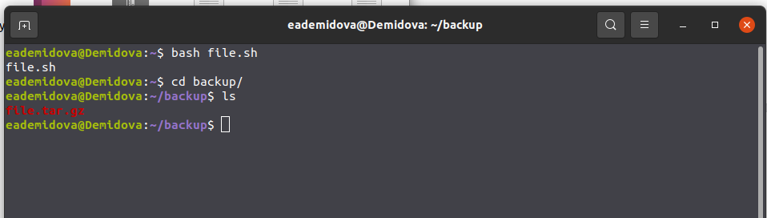
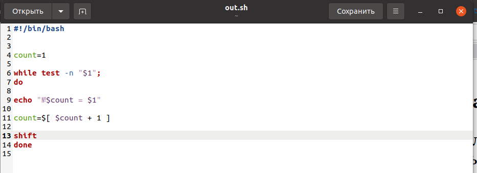
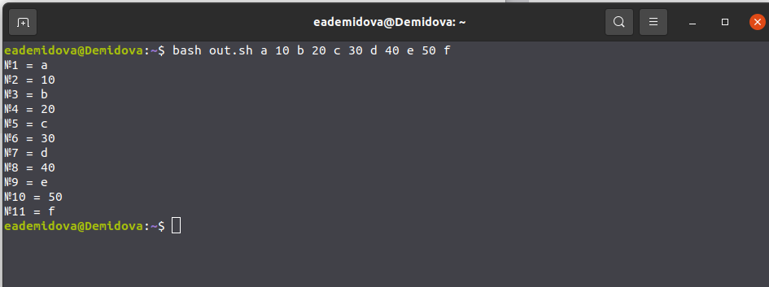
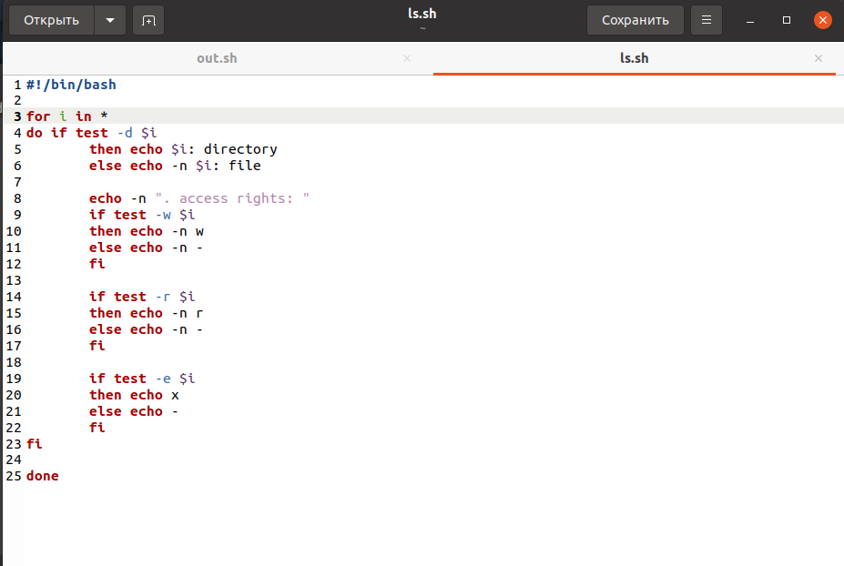
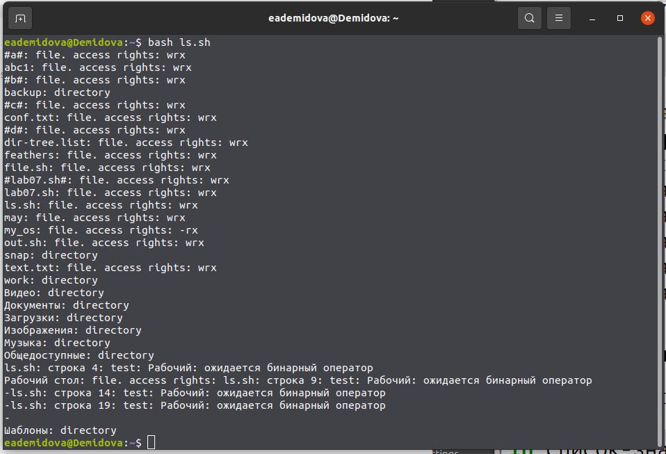
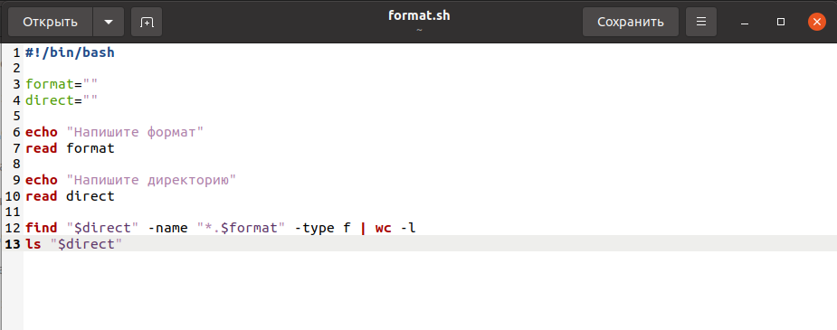
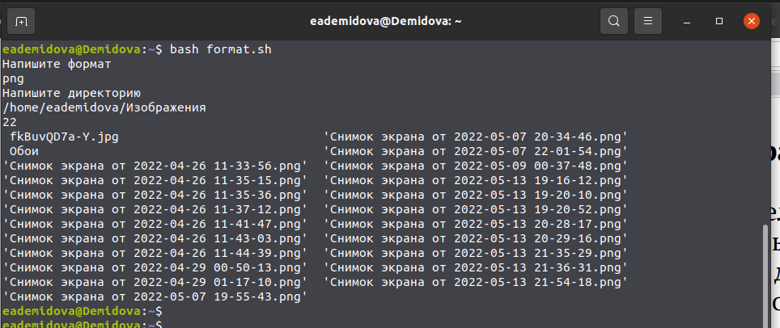

---
## Front matter
lang: ru-RU
title: Лабораторная работа №10
author: |
	Демидова Е.А.
institute: Российский Университет дружбы народов
date: Операционные системы -- 2022

## Formatting
toc: false
slide_level: 2
theme: metropolis
header-includes: 
 - \metroset{progressbar=frametitle,sectionpage=progressbar,numbering=fraction}
 - '\makeatletter'
 - '\beamer@ignorenonframefalse'
 - '\makeatother'
aspectratio: 43
section-titles: true
---

# Введение

## Введение

**Цель работы**

Изучить основы программирования в оболочке ОС UNIX/Linux. Научиться писать
небольшие командные файлы.

**Задачи**

1. Написать скрипт, который при запуске будет делать резервную копию самого себя (то
есть файла, в котором содержится его исходный код) в другую директорию backup.
2. Написать пример командного файла, обрабатывающего любое произвольное число
аргументов командной строки.
3. Написать командный файл — аналог команды ls.
4. Написать командный файл, который получает в качестве аргумента командной строки
формат файла (.txt, .doc, .jpg, .pdf и т.д.) и вычисляет количество таких файлов
в указанной директории.

# Результаты работы

## Скрипт 1

1. Написать скрипт, который при запуске будет делать резервную копию самого себя (то
есть файла, в котором содержится его исходный код) в другую директорию backup
в вашем домашнем каталоге. При этом файл должен архивироваться одним из ар-
хиваторов на выбор zip, bzip2 или tar. Способ использования команд архивации
необходимо узнать, изучив справку.
{ #fig:001 width=70% }

## Скрипт 1

Результат работы скрипта.
{ #fig:002 width=70% }

## Скрипт 2

2. Написать пример командного файла, обрабатывающего любое произвольное число
аргументов командной строки, в том числе превышающее десять. Например, скрипт
может последовательно распечатывать значения всех переданных аргументов.
{ #fig:003 width=70% }

## Скрипт 2

Результат работы скрипта.
{ #fig:004 width=70% }

## Скрипт 3

3. Написать командный файл — аналог команды ls (без использования самой этой ко-
манды и команды dir). Требуется, чтобы он выдавал информацию о нужном каталоге
и выводил информацию о возможностях доступа к файлам этого каталога.
{ #fig:005 width=70% }

## Скрипт 3

Результат работы скрипта.
{ #fig:006 width=70% }

## Скрипт 4

4. Написать командный файл, который получает в качестве аргумента командной строки
формат файла (.txt, .doc, .jpg, .pdf и т.д.) и вычисляет количество таких файлов
в указанной директории. Путь к директории также передаётся в виде аргумента ко-
мандной строки.
{ #fig:007 width=70% }

## Скрипт 4

Результат работы скрипта.
{ #fig:008 width=70% }

## Выводы

Изучила основы программирования в оболочке ОС UNIX/Linux. Научилась писать
небольшие командные файлы.

## Список литературы

1. Командные процессоры ОС UNIX [Электронный ресурс]. life-prog.ru, 2014.
URL: https://life-prog.ru/1_54716_glava--komandnie-protsessori-os-
UNIX.html.

## {.standout}

Спасибо за внимание
