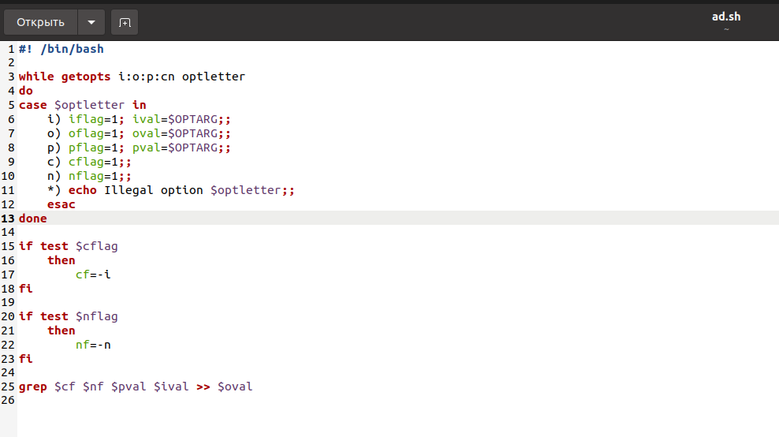
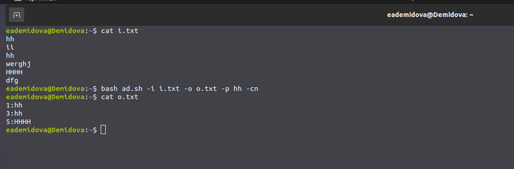
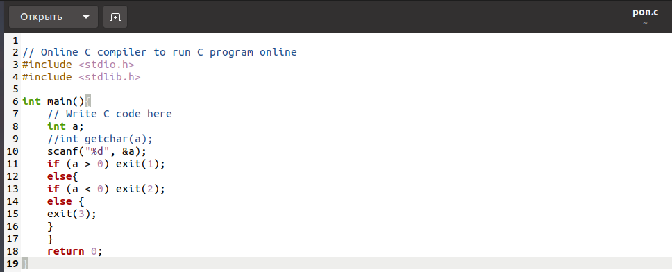
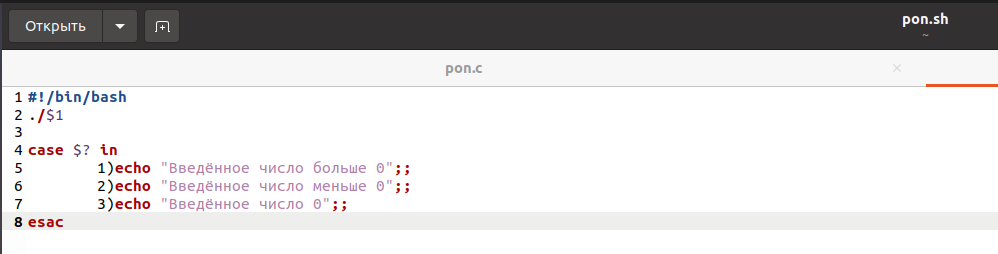
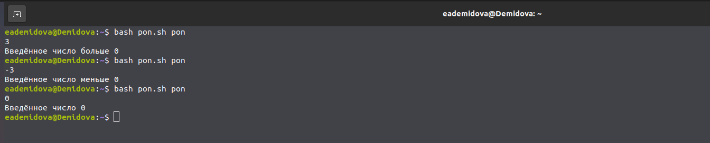
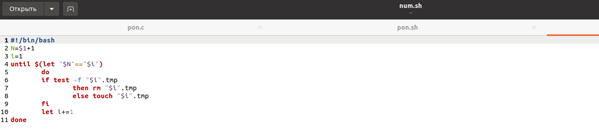
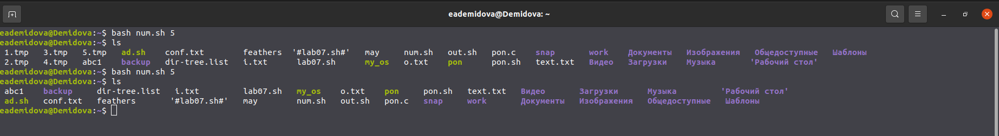
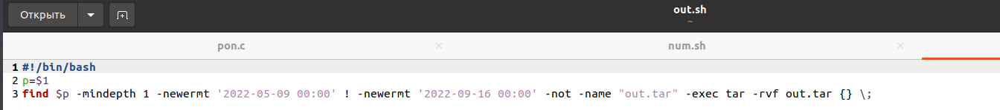
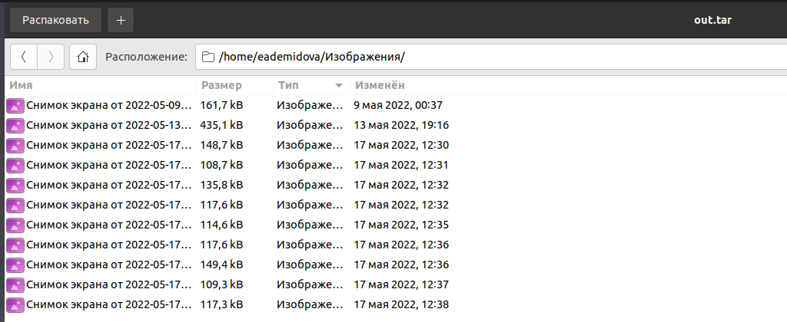

---
## Front matter
lang: ru-RU
title: Лабораторная работа №11
author: |
	Демидова Е.А.
institute: Российский Университет дружбы народов
date: Операционные системы -- 2022

## Formatting
toc: false
slide_level: 2
theme: metropolis
header-includes: 
 - \metroset{progressbar=frametitle,sectionpage=progressbar,numbering=fraction}
 - '\makeatletter'
 - '\beamer@ignorenonframefalse'
 - '\makeatother'
aspectratio: 43
section-titles: true
---

# Введение

## Введение

**Цель работы**

Изучить основы программирования в оболочке ОС UNIX. Научится писать более
сложные командные файлы с использованием логических управляющих конструкций
и циклов.

## Введение

**Задачи**

1. Используя команды getopts grep, написать командный файл, который анализирует командную строку с определёнными ключами ключами, а затем ищет в указанном файле нужные строки.
2. Написать на языке Си программу, которая вводит число и определяет знак. Командный файл должен вызывать эту программу и выдать сообщение о том, какое число было введено.
3. Написать командный файл, создающий указанное число файлов, пронумерованных последовательно от 1 до N , и удаляющий все созданные им файлы (если они существуют)
4. Написать командный файл, который запаковывает в архив все файлы в указанной директории, которые были изменены менее недели тому назад.

# Результаты работы

## Скрипт 1

1. Используя команды getopts grep, написать командный файл, который анализирует
командную строку с ключами:
 - iinputfile — прочитать данные из указанного файла
 - ooutputfile — вывести данные в указанный файл;
 - pшаблон — указать шаблон для поиска;
 - C — различать большие и малые буквы;
 - n — выдавать номера строк.
а затем ищет в указанном файле нужные строки, определяемые ключом -p.
{ #fig:001 width=70% }

## Скрипт 1

Результат работы скрипта.
{ #fig:002 width=80% }

## Скрипт 2

2. Написать на языке Си программу, которая вводит число и определяет, является ли оно
больше нуля, меньше нуля или равно нулю. Затем программа завершается с помощью
функции exit(n), передавая информацию в о коде завершения в оболочку. Команд-
ный файл должен вызывать эту программу и, проанализировав с помощью команды
$?, выдать сообщение о том, какое число было введено.
{ #fig:003 width=70% }
{ #fig:004 width=70% }

## Скрипт 2

Результат работы скрипта.
{ #fig:005 width=80% }

## Скрипт 3

3. Написать командный файл, создающий указанное число файлов, пронумерованных
последовательно от 1 до 𝑁 (например 1.tmp, 2.tmp, 3.tmp,4.tmp и т.д.). Число файлов,
которые необходимо создать, передаётся в аргументы командной строки. Этот же ко-
мандный файл должен уметь удалять все созданные им файлы (если они существуют).
{ #fig:006 width=80% }

## Скрипт 3

Результат работы скрипта.
{ #fig:007 width=80% }

## Скрипт 4

4. Написать командный файл, который с помощью команды tar запаковывает в архив
все файлы в указанной директории. Модифицировать его так, чтобы запаковывались
только те файлы, которые были изменены менее недели тому назад (использовать
команду find).
{ #fig:008 width=80% }

## Скрипт 4

Результат работы скрипта.
{ #fig:009 width=80% }

## Выводы

В результате выполнения лаборатаорной работы я изучила основы программирования в оболочке ОС UNIX. Научилась писать более сложные командные файлы с использованием логических управляющих конструкций и циклов.

## Список литературы

1. Командные процессоры ОС UNIX [Электронный ресурс]. life-prog.ru, 2014.
URL: https://life-prog.ru/1_54716_glava--komandnie-protsessori-os-
UNIX.html.

## {.standout}

Спасибо за внимание
