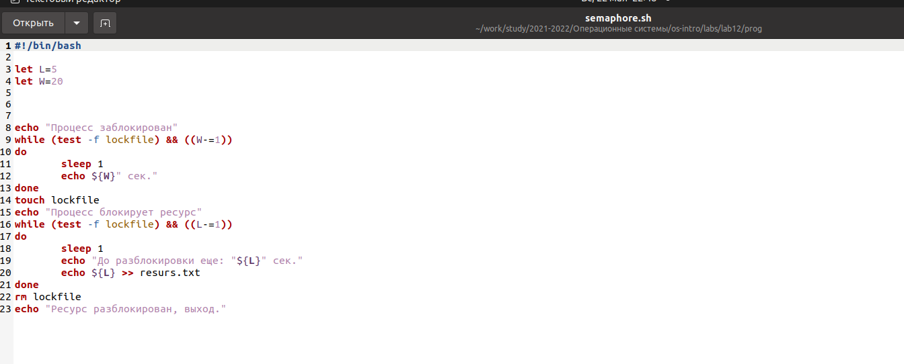
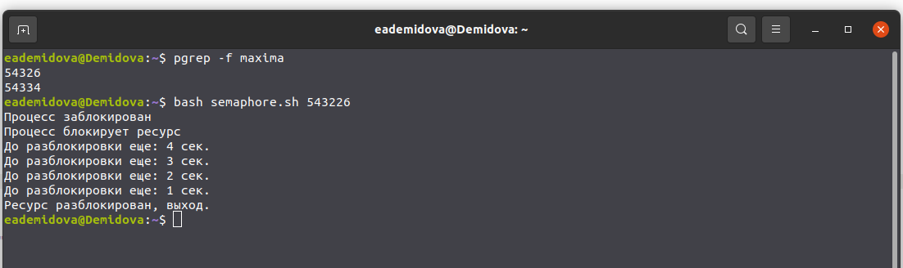
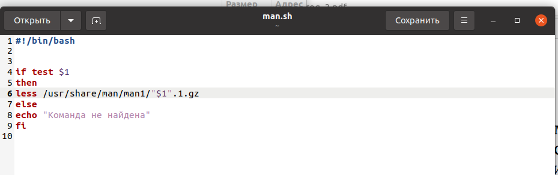
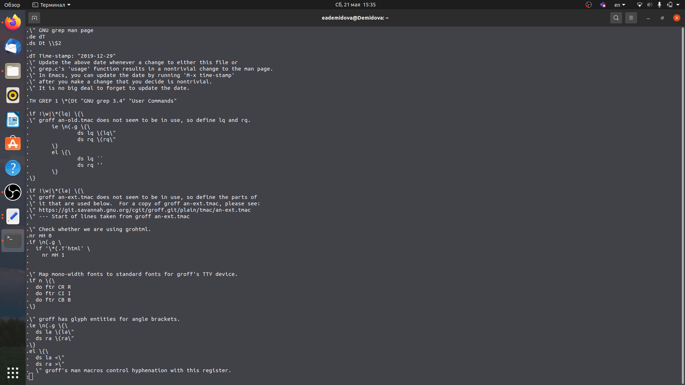
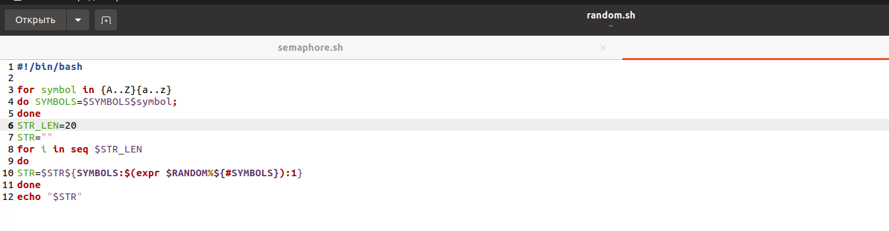
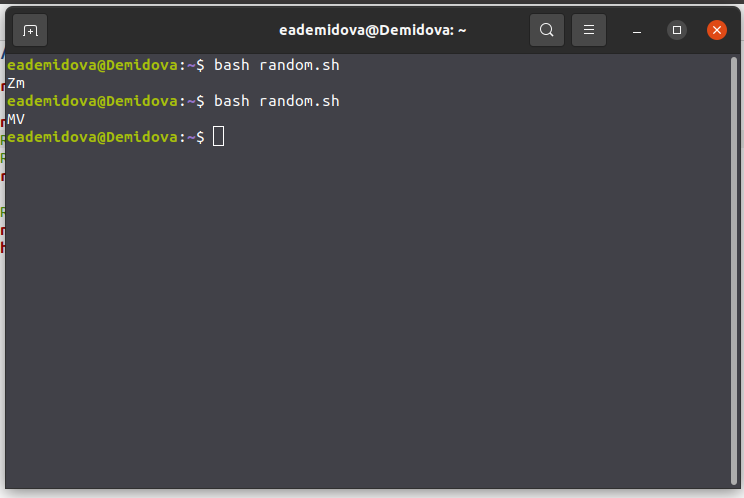

---
## Front matter
lang: ru-RU
title: Лабораторная работа №12
author: |
	Демидова Е.А.
institute: Российский Университет дружбы народов
date: Операционные системы -- 2022

## Formatting
toc: false
slide_level: 2
theme: metropolis
header-includes: 
 - \metroset{progressbar=frametitle,sectionpage=progressbar,numbering=fraction}
 - '\makeatletter'
 - '\beamer@ignorenonframefalse'
 - '\makeatother'
aspectratio: 43
section-titles: true
---

# Введение

## Введение

**Цель работы**

Изучить основы программирования в оболочке ОС UNIX. Научиться писать более
сложные командные файлы с использованием логических управляющих конструкций
и циклов.

**Задачи**

1. Написать командный файл, реализующий упрощённый механизм семафоров.
2. Реализовать команду man с помощью командного файла.
3. Используя встроенную переменную $RANDOM, напишите командный файл, генерирующий случайную последовательность букв латинского алфавита..

# Результаты работы

## Скрипт 1

1. Написать командный файл, реализующий упрощённый механизм семафоров. Командный файл должен в течение некоторого времени t1 дожидаться освобождения
ресурса, выдавая об этом сообщение, а дождавшись его освобождения, использовать
его в течение некоторого времени t2<>t1, также выдавая информацию о том, что
ресурс используется соответствующим командным файлом (процессом).
{ #fig:001 width=70% }

## Скрипт 1

Результат работы скрипта.
{ #fig:002 width=70% }

## Скрипт 2

2. Реализовать команду man с помощью командного файла. Изучите содержимое ката-
лога /usr/share/man/man1. В нем находятся архивы текстовых файлов, содержащих
справку по большинству установленных в системе программ и команд. Каждый архив
можно открыть командой less сразу же просмотрев содержимое справки. Командный
файл должен получать в виде аргумента командной строки название команды и в виде
результата выдавать справку об этой команде или сообщение об отсутствии справки,
если соответствующего файла нет в каталоге man1.
{ #fig:003 width=70% }

## Скрипт 2

Результат работы скрипта.
{ #fig:004 width=70% }

## Скрипт 3

3. Используя встроенную переменную $RANDOM, напишите командный файл, генерирую-
щий случайную последовательность букв латинского алфавита. Учтите, что $RANDOM
выдаёт псевдослучайные числа в диапазоне от 0 до 32767
{ #fig:005 width=70% }

## Скрипт 3

Результат работы скрипта.
{ #fig:006 width=70% }

## Выводы

Изучила основы программирования в оболочке ОС UNIX. Научилась писать более
сложные командные файлы с использованием логических управляющих конструкций
и циклов.

## Список литературы

1. Командные процессоры ОС UNIX [Электронный ресурс]. life-prog.ru, 2014.
URL: https://life-prog.ru/1_54716_glava--komandnie-protsessori-os-
UNIX.html.

## {.standout}

Спасибо за внимание
