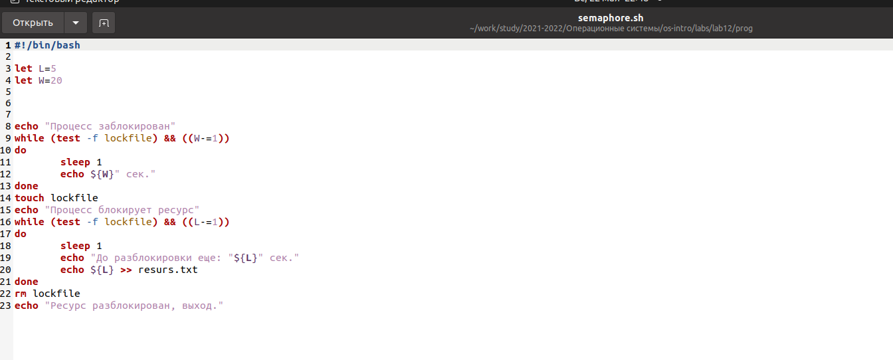
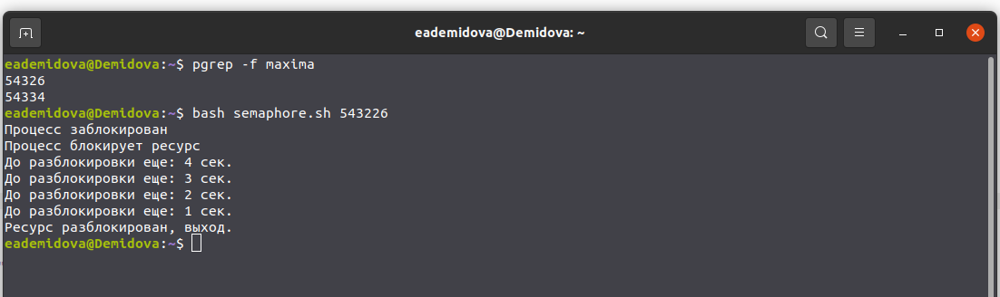
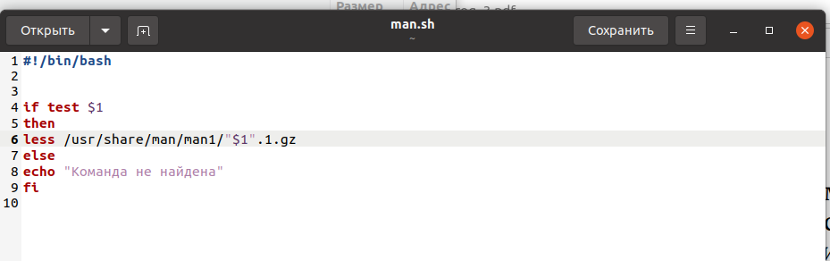
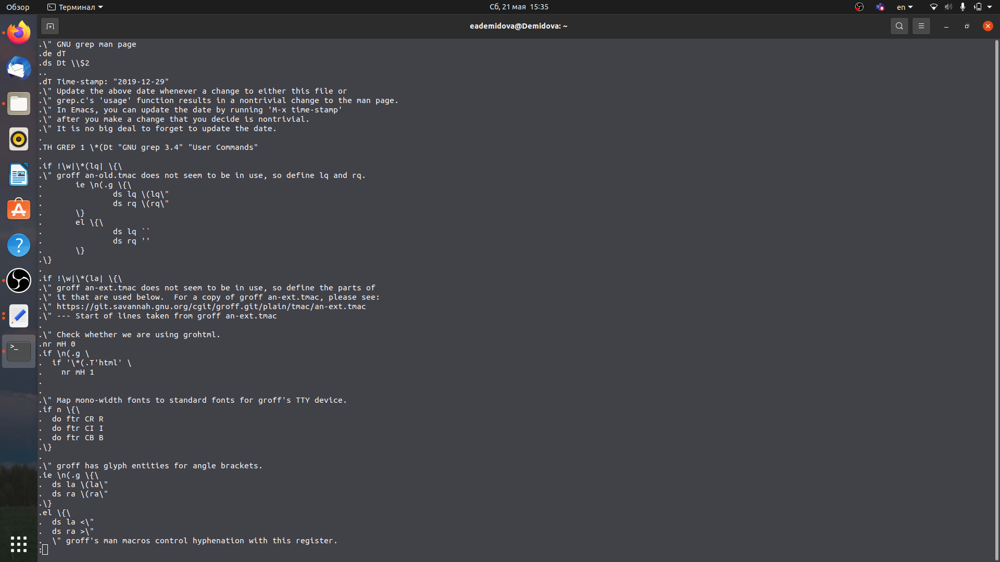
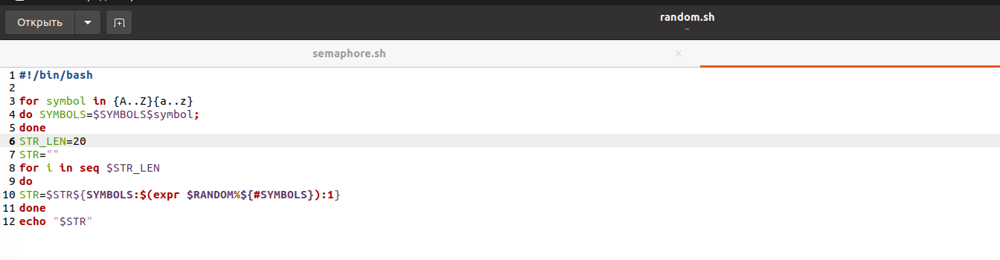
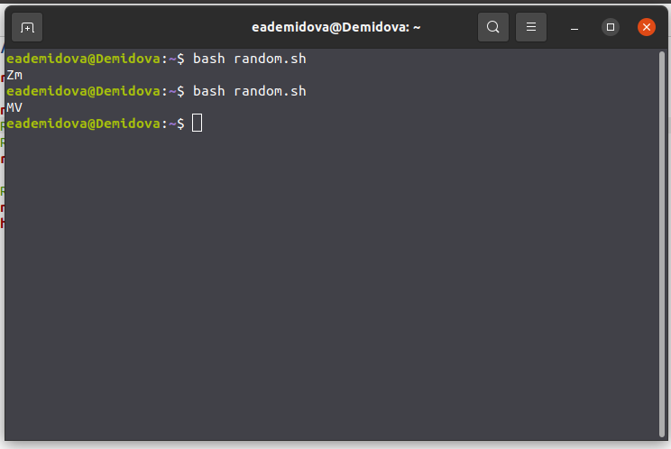

---
## Front matter
title: "Лабораторная работа №12"
subtitle: "Программирование в командном процессоре ОС UNIX. Командные файлы"
author: "Демидова Екатерина Алексеевна"

## Generic otions
lang: ru-RU
toc-title: "Содержание"

## Bibliography
bibliography: bib/cite.bib
csl: pandoc/csl/gost-r-7-0-5-2008-numeric.csl

## Pdf output format
toc: true # Table of contents
toc-depth: 2
lof: true # List of figures
lot: false # List of tables
fontsize: 12pt
linestretch: 1.5
papersize: a4
documentclass: scrreprt
## I18n polyglossia
polyglossia-lang:
  name: russian
  options:
	- spelling=modern
	- babelshorthands=true
polyglossia-otherlangs:
  name: english
## I18n babel
babel-lang: russian
babel-otherlangs: english
## Fonts
mainfont: PT Serif
romanfont: PT Serif
sansfont: PT Sans
monofont: PT Mono
mainfontoptions: Ligatures=TeX
romanfontoptions: Ligatures=TeX
sansfontoptions: Ligatures=TeX,Scale=MatchLowercase
monofontoptions: Scale=MatchLowercase,Scale=0.9
## Biblatex
biblatex: true
biblio-style: "gost-numeric"
biblatexoptions:
  - parentracker=true
  - backend=biber
  - hyperref=auto
  - language=auto
  - autolang=other*
  - citestyle=gost-numeric
## Pandoc-crossref LaTeX customization
figureTitle: "Рис."
tableTitle: "Таблица"
listingTitle: "Листинг"
lofTitle: "Список иллюстраций"
lotTitle: "Список таблиц"
lolTitle: "Листинги"
## Misc options
indent: true
header-includes:
  - \usepackage{indentfirst}
  - \usepackage{float} # keep figures where there are in the text
  - \floatplacement{figure}{H} # keep figures where there are in the text
---

# Цель работы

Изучить основы программирования в оболочке ОС UNIX. Научиться писать более
сложные командные файлы с использованием логических управляющих конструкций
и циклов.

# Задание

1. Написать командный файл, реализующий упрощённый механизм семафоров. Ко-
мандный файл должен в течение некоторого времени t1 дожидаться освобождения
ресурса, выдавая об этом сообщение, а дождавшись его освобождения, использовать
его в течение некоторого времени t2<>t1, также выдавая информацию о том, что
ресурс используется соответствующим командным файлом (процессом). Запустить
командный файл в одном виртуальном терминале в фоновом режиме, перенаправив
его вывод в другой (> /dev/tty#, где # — номер терминала куда перенаправляется
вывод), в котором также запущен этот файл, но не фоновом, а в привилегированном
режиме. Доработать программу так, чтобы имелась возможность взаимодействия трёх
и более процессов.
2. Реализовать команду man с помощью командного файла. Изучите содержимое ката-
лога /usr/share/man/man1. В нем находятся архивы текстовых файлов, содержащих
справку по большинству установленных в системе программ и команд. Каждый архив
можно открыть командой less сразу же просмотрев содержимое справки. Командный
файл должен получать в виде аргумента командной строки название команды и в виде
результата выдавать справку об этой команде или сообщение об отсутствии справки,
если соответствующего файла нет в каталоге man1.
3. Используя встроенную переменную $RANDOM, напишите командный файл, генерирую-
щий случайную последовательность букв латинского алфавита. Учтите, что $RANDOM
выдаёт псевдослучайные числа в диапазоне от 0 до 32767

# Теоретическое введение

При интерактивной работе с операционной системой пользователь постоянно сталкивается с необходимостью отдавать ей команды. В UNIX эту работу выполняет программа, которая называется командным процессором (shell). Иногда командный процессор называют шеллом или оболочкой, или интерпретатором команд (последнее неточно, потому что круг задач командного процессора шире, чем интерпретация команд).

Shell действует как посредник между вами и ядром операционной системы. Ядро – это часть операционной системы, которая всегда находится в памяти компьютера, это программа. Командный процессор преобразует ваши команды в инструкции для операционной системы, а операционная система превращает их в инструкции для аппаратных средств компьютера. По сути, именно оболочка придает определенную “персонализацию” системам UNIX.

Командный процессор выполняет в системе следующие задачи:

- интерпретация команд пользователя, в том числе разбор командной строки;

- запуск программ;

- организация перенаправлений потоков между процессами;

- интерпретация языка скриптов и их выполнение;

- управление заданиями;

- интерпретация шаблонов имен файлов;

- подстановка имен файлов в командную строку.

Кроме того, shell является мощным языком программирования.

Любая команда, являющаяся отдельной программой, т.е. не встроенной в интерпретатор, будет выполняться одинаково, независимо от shell'a. Например, если вы хотите что–то напечатать, команда печати всегда работает одинаково.

Некоторые команды встроены в shell, т.е. они являются частью программы оболочки и, как следствие, могут выполняться по-разному в зависимости от оболочки, в которой они запускаются. Есть три вида команд, встроенных в shell:

- общие команды запускаются несколько быстрее, так как они являются частью оболочки;

- команды адаптации позволяют адаптировать оболочку.

- команды программирования образуют язык программирования оболочки.

При смене shell'a вы не заметите никакой разницы между общими командами, которые встроены просто для повышения быстродействия. Однако команды адаптации и программирования изменяются.

Примером общих команд, встроенных в оболочку, служат команды cd, echo, pwd, login, umask.

Адаптация включает в себя создание новых команд или новых имен для старых команд и привлечение новых возможностей. Примером общепринятой адаптации служит изменение стимула (или приглашения системы).[@lp:bash].

# Выполнение лабораторной работы


1. 1. Написать командный файл, реализующий упрощённый механизм семафоров. Ко-
мандный файл должен в течение некоторого времени t1 дожидаться освобождения
ресурса, выдавая об этом сообщение, а дождавшись его освобождения, использовать
его в течение некоторого времени t2<>t1, также выдавая информацию о том, что
ресурс используется соответствующим командным файлом (процессом). Запустить
командный файл в одном виртуальном терминале в фоновом режиме, перенаправив
его вывод в другой (> /dev/tty#, где # — номер терминала куда перенаправляется
вывод), в котором также запущен этот файл, но не фоновом, а в привилегированном
режиме. Доработать программу так, чтобы имелась возможность взаимодействия трёх
и более процессов.  (рис. [-@fig:001;-@fig:002])

{ #fig:001 width=70% }

{ #fig:002 width=70% }

2. Реализовать команду man с помощью командного файла. Изучите содержимое ката-
лога /usr/share/man/man1. В нем находятся архивы текстовых файлов, содержащих
справку по большинству установленных в системе программ и команд. Каждый архив
можно открыть командой less сразу же просмотрев содержимое справки. Командный
файл должен получать в виде аргумента командной строки название команды и в виде
результата выдавать справку об этой команде или сообщение об отсутствии справки,
если соответствующего файла нет в каталоге man1..(рис. [-@fig:003;-@fig:004])

{ #fig:003 width=70% }

{ #fig:004 width=70% }

3. Используя встроенную переменную $RANDOM, напишите командный файл, генерирую-
щий случайную последовательность букв латинского алфавита. Учтите, что $RANDOM
выдаёт псевдослучайные числа в диапазоне от 0 до 32767 (рис. [-@fig:005;-@fig:006])

{ #fig:005 width=70% }

{ #fig:006 width=70% }

# Контрольные вопросы

1. В следующей строке кода синтаксическая ошибка состоит в том, что после первой и перед последней квадратными скобками пропущены пробелы.
```
while [$1 != "exit"]
```
2. Как объединить (конкатенация) несколько строк в одну?
Самый простой способ объединить две или более строковые переменные – записать их одну за другой
```
VAR1="Hello,"
VAR2=" World"
VAR3="$VAR1$VAR2"
echo "$VAR3"

Hello, World
```
Вы также можете объединить одну или несколько переменных с литеральными строками:
```
VAR1="Hello,"
VAR2="${VAR1}World"
echo "$VAR2"

Hello, World
```
3. Найдите информацию об утилите seq. Какими иными способами можно реализовать
её функционал при программировании на bash?

Эта утилита выводит последовательность целых чисел с шагом, заданным пользователем.
По-умолчанию, выводимые числа отделяются друг от друга символом перевода строки, однако, с помощью ключа -s может быть задан другой разделитель.
```
bash$ seq 5
1
2
3
4
5


bash$ seq -s : 5
1:2:3:4:5
```
Её функционал можно реализовать с помощью утилиты jot.

4. Вычисление выражения `$((10/3))` даст результат 3?

5. Укажите кратко основные отличия командной оболочки zsh от bash.

- Zsh более интерактивный и настраиваемый, чем Bash.
- У Zsh есть поддержка с плавающей точкой, которой нет у Bash.
- В Zsh поддерживаются структуры хеш-данных, которых нет в Bash.
- Функции вызова в Bash лучше по сравнению с Zsh.
- Внешний вид подсказки можно контролировать в Bash, тогда как Zsh настраивается.
- Конфигурационными файлами являются .bashrc в интерактивных оболочках без регистрации
и .profile или .bash_profile в оболочках входа в Bash. В Zsh оболочками, не входящими в систему,
являются .zshrc, а оболочками для входа - .zprofile.
- Массивы Zsh индексируются от 1 до длины, тогда как Bash индексируется от -1 до длины.
- В Zsh, если шаблоны не совпадают ни с одним файлом, выдается ошибка. Находясь в Баше, он
остается без изменений.
- Правая часть конвейера запускается как родительская оболочка в Zsh, в то время как в Bash она
запускается как подоболочка.
- В Zsh функция zmv используется для массового переименования, тогда как в Bash мы должны
использовать функцию расширения параметров.
- Bash имеет хорошие возможности написания сценариев в одной строке, в то время как в Zsh мы не
смогли найти то же самое.
- По умолчанию выходные данные хранятся во временном файле в Zsh, а в Bash - нет.
- Многие встроенные функции в Bash упрощают сложные программы, тогда как в Zsh встроенных функций для сложных программ меньше.
- Zsh эффективно управляет своими файлами, в то время как Bash плохо умеет работать с файлами.

6. Синтаксис данной конструкции верен.
```
for ((a=1; a <= LIMIT; a++))
```

7. Сравните язык bash с какими-либо языками программирования. Какие преимущества
у bash по сравнению с ними? Какие недостатки?

 Python — популярная альтернатива Bash для написания сценариев настройки среды, сборки и выпуска.
Проект Electron использует Python для сценариев нескольких утилит. В Python нельзя выполнять
команды напрямую, поскольку это не командный язык. Но запуск команд и перехват вывода
реализуются проще простого с помощью модуля subprocess.
Используя встроенные функции Python, можно писать современные сложные Shell-сценарии. Но, в
отличие от Bash, интерпретатор Python изначально не поддерживает выполнение процесса. Поэтому,
если нужно упростить сценарий Python, чтобы он больше походил на Bash, используется такой
инструмент, как Shellpy. 

 Стоит делать свой выбор между Bash, Python и JavaScript при написании Shell-сценариев, основываясь на следующих фактах и условиях:

 Если вам нужно часто инициировать процессы и писать небольшой переносимый Shell-сценарий для
Unix или Unix-подобных операционных систем, Bash, несомненно, будет хорошим выбором. Например,\
я написал сценарий Bash для сборки двоичных файлов проекта с открытым исходным кодом,
основанного на пользовательской архитектуре.
 Если вам нужно написать кроссплатформенный Shell-скрипт для обработки некоторых данных и
выполнения определенных команд, можете выбрать Python. Например, в проекте Electron есть
несколько сценариев Python для обработки и загрузки файлов. Однако не стоит ожидать высокой
производительности от Shell-сценариев на базе Python.
 JavaScript отлично подходит для тех же сценариев, что и Python. Однако, в отличие от Python,
JavaScript имеет некоторые дополнительные преимущества. JavaScript быстр, изначально
поддерживает JSON и имеет впечатляющие встроенные функции. Я нашел несколько сценариев Shell на
базе Javascript в каталоге сценариев репозитория React Native.

# Выводы

Изучила основы программирования в оболочке ОС UNIX. Научилась писать более
сложные командные файлы с использованием логических управляющих конструкций
и циклов.

# Список литературы{.unnumbered}

::: {#refs}
:::
