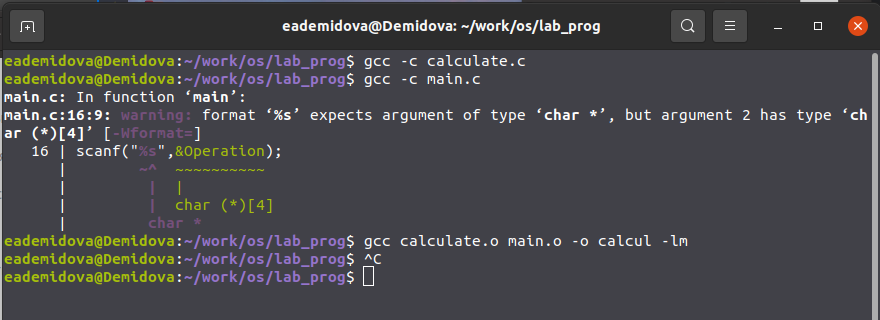
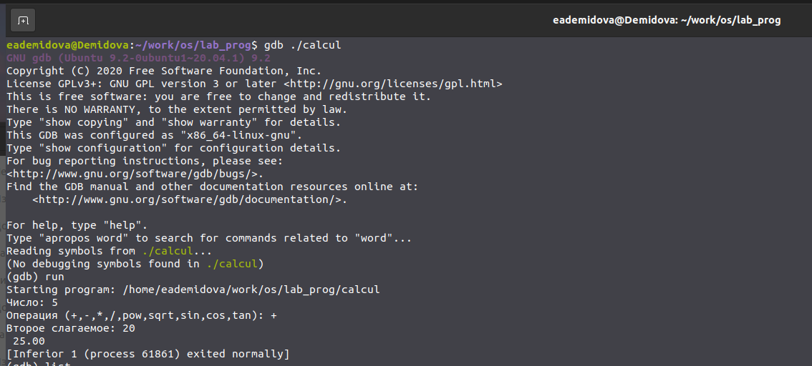
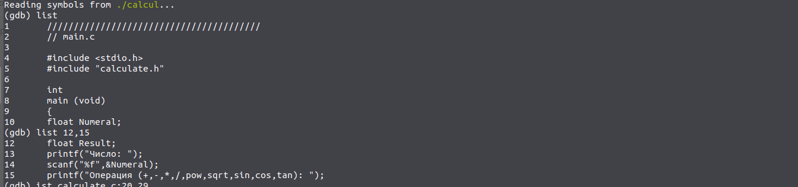
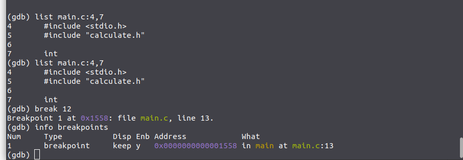
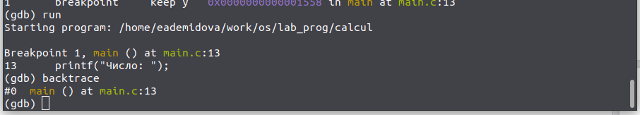
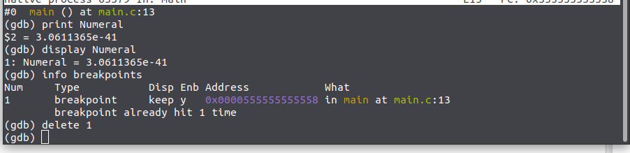
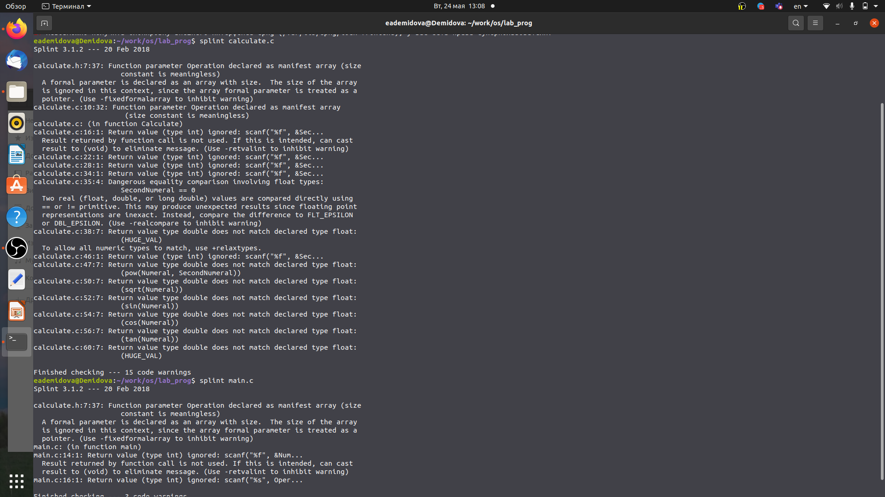

---
## Front matter
lang: ru-RU
title: Лабораторная работа №13
author: |
	Демидова Е.А.
institute: Российский Университет дружбы народов
date: Операционные системы -- 2022

## Formatting
toc: false
slide_level: 2
theme: metropolis
header-includes: 
 - \metroset{progressbar=frametitle,sectionpage=progressbar,numbering=fraction}
 - '\makeatletter'
 - '\beamer@ignorenonframefalse'
 - '\makeatother'
aspectratio: 43
section-titles: true
---

# Введение

## Введение

**Цель работы**

Приобрести простейшие навыки разработки, анализа, тестирования и отладки приложений в ОС типа UNIX/Linux на примере создания на языке программирования С калькулятора с простейшими функциями.

## Введение

**Задачи**

1. В домашнем каталоге создайте подкаталог ~/work/os/lab_prog.
2. Создайте в нём файлы: calculate.h, calculate.c, main.c.
Это будет примитивнейший калькулятор, способный складывать, вычитать, умножать
и делить, возводить число в степень, брать квадратный корень, вычислять sin, cos, tan.
При запуске он будет запрашивать первое число, операцию, второе число. После этого
программа выведет результат и остановится.
3. Выполните компиляцию программы посредством gcc.
4. При необходимости исправьте синтаксические ошибки.
5. Создайте Makefile.
6. С помощью gdb выполните отладку программы calcul.
7. С помощью утилиты splint попробуйте проанализировать коды файлов calculate.c
и main.c.

# Результаты работы

## Создание каталога и файлов

В домашнем каталоге создадим подкаталог ~/work/os/lab_prog. Создадим в нём файлы: calculate.h, calculate.c, main.c. Это будет примитивнейший калькулятор, способный складывать, вычитать, умножать и делить, возводить число в степень, брать квадратный корень, вычислять sin, cos, tan.
При запуске он будет запрашивать первое число, операцию, второе число. После этого
программа выведет результат и остановится.
{ #fig:001 width=70% }

## Компиляция

Выполним компиляцию программы посредством gcc Затем исправим ошибку в файле main.c, уберем амперсант перед считыванием Operation. А также создадим Makefile.
{ #fig:002 width=70% }

## Запуск GDB

С помощью gdb выполним отладку программы calcul.Запустим отладчик GDB, загрузив в него программу для отладки с помощью команды gdb ./calcul. Для запуска программы внутри отладчика введём команду run.
{ #fig:003 width=70% }

## Использование list

Для постраничного (по 9 строк) просмотра исходного код используем команду
list. Для просмотра строк с 12 по 15 основного файла используем list с параметрами. Для просмотра определённых строк не основного файла используем list с параметрами.
{ #fig:004 width=70% }

## Точка останова

Установим точку останова в файле calculate.c на строке номер 12. Выведем информацию об имеющихся в проекте точка останова.
{ #fig:005 width=70% }

## Запуск программы с точкой останова

Запустим программу внутри отладчика и убедимсяь, что программа остановится
в момент прохождения точки останова.
{ #fig:006 width=70% }

## Значение переменной Numeral

Посмотрим, чему равно на этом этапе значение переменной Numeral. Сравним с результатом вывода на экран, они равны. Уберём точки останова.
{ #fig:007 width=70% }

## Утилита splint

С помощью утилиты splint попробуем проанализировать коды файлов calculate.c
и main.c.
{ #fig:008 width=70% }

## Выводы

В результате выполнения лабораторной работы приобрела простейшие навыки разработки, анализа, тестирования и отладки приложений в ОС типа UNIX/Linux на примере создания на языке программирования С калькулятора с простейшими функциями.

## Список литературы

1. Отладчик GDB [Электронный ресурс]. Maxim Chirkov, 2002. URL: https:
//www.opennet.ru/docs/RUS/linux_base/node199.html.

## {.standout}

Спасибо за внимание
