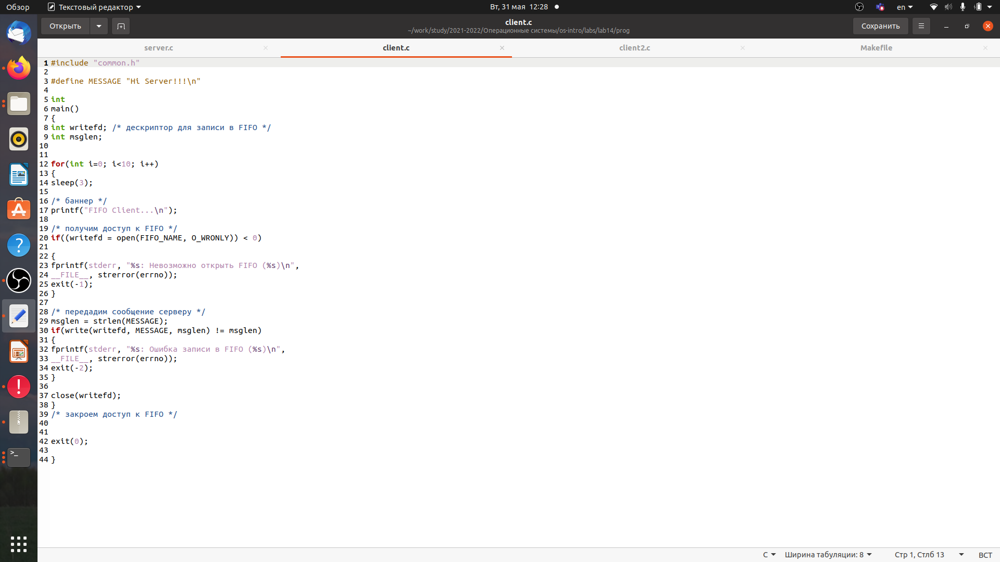
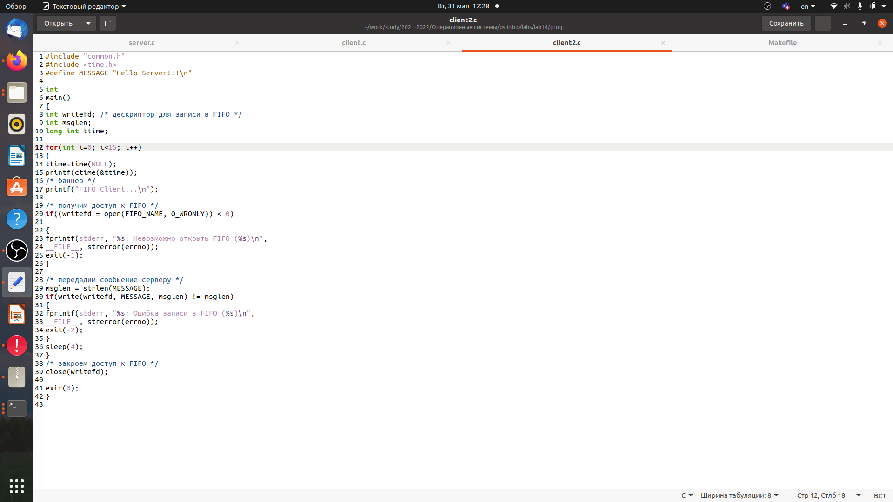
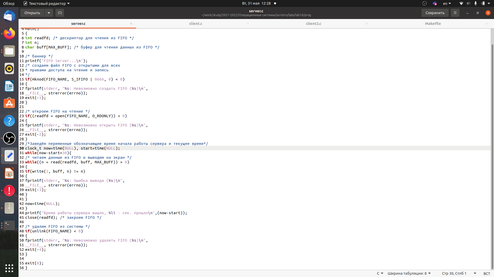
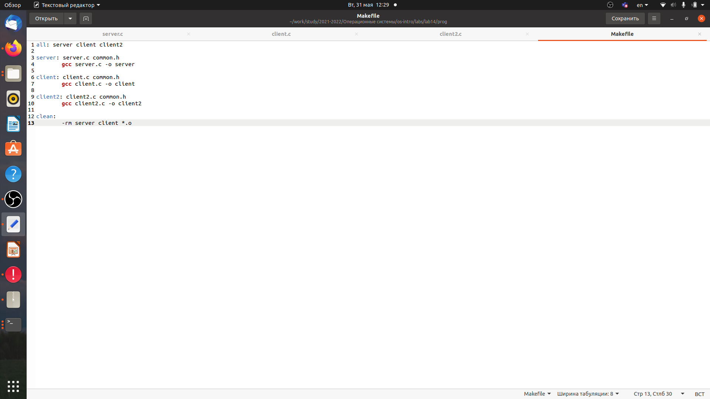
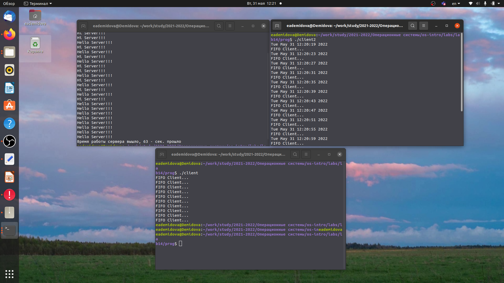

---
## Front matter
lang: ru-RU
title: Лабораторная работа №14
author: |
	Демидова Е.А.
institute: Российский Университет дружбы народов
date: Операционные системы -- 2022

## Formatting
toc: false
slide_level: 2
theme: metropolis
header-includes: 
 - \metroset{progressbar=frametitle,sectionpage=progressbar,numbering=fraction}
 - '\makeatletter'
 - '\beamer@ignorenonframefalse'
 - '\makeatother'
aspectratio: 43
section-titles: true
---

# Введение

## Введение

**Цель работы**

Приобретение практических навыков работы с именованными каналами.

## Введение

**Задачи**

Взяв данные примеры за образец, напишите аналогичные программы, внеся следующие изменения:

1. Работает не 1 клиент, а несколько (например, два).

2. Клиенты передают текущее время с некоторой периодичностью (например, раз в пять
секунд). Используйте функцию sleep() для приостановки работы клиента.

3. Сервер работает не бесконечно, а прекращает работу через некоторое время (напри-
мер, 30 сек). Используйте функцию clock() для определения времени работы сервера.
Что будет в случае, если сервер завершит работу, не закрыв канал?

# Результаты работы

## Изменение кода

 Изучила приведённые в тексте программы server.c и client.c. Взяв данные примеры
за образец, напишем аналогичные программы, внеся следующие изменения.
 Работает не 1 клиент, а несколько (например, два).
{ #fig:001 width=80% }

## Изменение кода

 Клиенты передают текущее время с некоторой периодичностью (например, раз в пять
секунд). Используйте функцию sleep() для приостановки работы клиента.
{ #fig:002 width=80% }

## Изменение кода

 Сервер работает не бесконечно, а прекращает работу через некоторое время (напри-
мер, 30 сек). Используйте функцию clock() для определения времени работы сервера.
В случае, если сервер завершит работу, не закрыв канал, файл FIFO не удалится, поэтому его в следующий раз создать будет нельзя и вылезет ошибка, следовательно, работать ничего не будет.
{ #fig:003 width=80% }

## Изменение кода

Выполним компиляцию с помощью Makefile.
{ #fig:004 width=80% }

## Запуск программы

Проверим работу программы.
{ #fig:005 width=80% }

## Выводы

В результате выполнения лабораторной работы приобрела практические навыки работы с именованными каналами.

## Список литературы

1. Именованные каналы [Электронный ресурс]. Wikimedia Foundation, Inc.,
2022, URL: https://ru.wikipedia.org/wiki/%D0%98%D0%BC%D0%B5%D0%BD
%D0%BE%D0%B2%D0%B0%D0%BD%D0%BD%D1%8B%D0%B9_%D0%BA%D0
%B0%D0%BD%D0%B0%D0%BB.

## {.standout}

Спасибо за внимание
